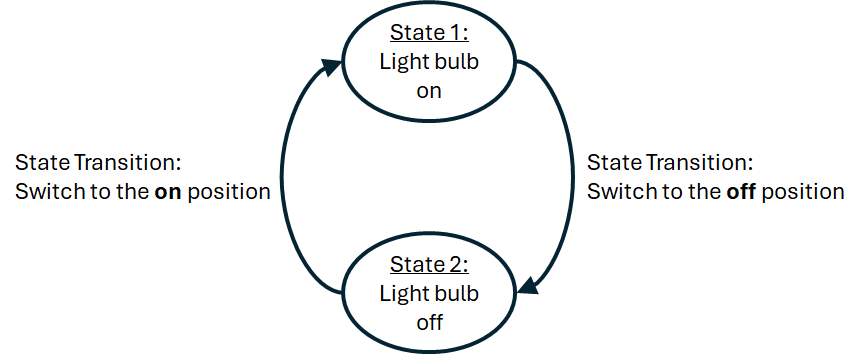
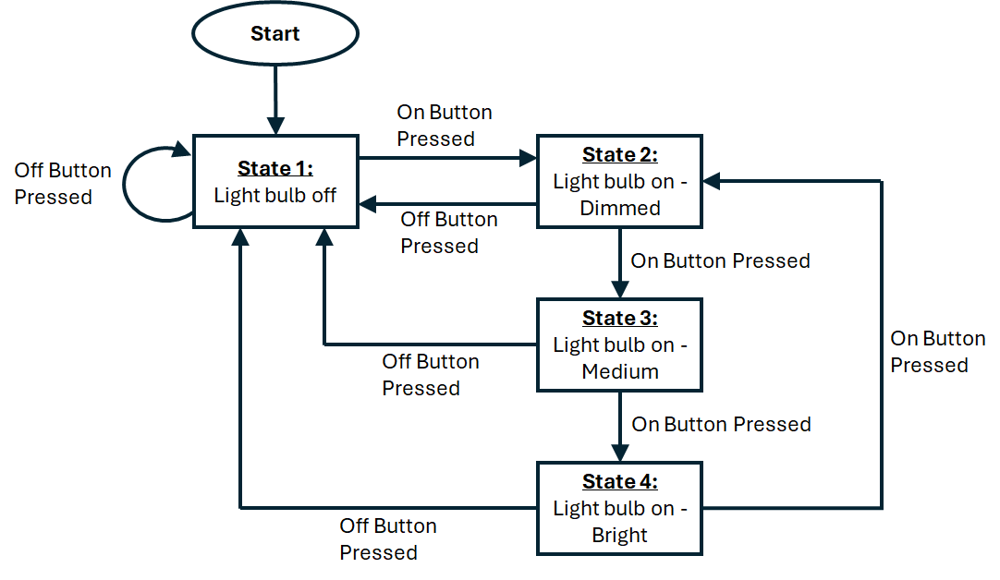

# Closed Loop Control Using the Encoder as a Feedback Sensor

!!! Info "GTA Marking"
    This is an assessed Exercise. When you have completed the <debugHL>[Assessed Exercise](#calibPotEx)</debugHL>, you should show your work to a GTA to get marked.

!!! Note "Before Continuing"
    Before starting these exercises, you should ensure that you have completed all the <debugHL>[Basic Exercises](../BasicExercises/README.md)</debugHL> and have fully constructed the robot chassis, as described in the <debugHL>[Building the Robot](../RobotBuild.md)</debugHL> document.


## Introduction

During this exercise you will write a program to move the robot chassis forwards and backwards through a sequence of set distances. The robot must be controlled in closed loop, using a PI controller, and using the motor encoder as the feedback sensor.

Your code should use a simple finite state machine to control the sequences of operation.

The following video is a quick demonstration of the final outcome from this exercise:

<figure>
<div style="text-align: center;">
<iframe id="kaltura_player" src='https://cdnapisec.kaltura.com/p/2103181/embedPlaykitJs/uiconf_id/53345422?iframeembed=true&amp;entry_id=1_sf98riu0&amp;config%5Bprovider%5D=%7B%22widgetId%22%3A%221_zed54ef2%22%7D&amp;config%5Bplayback%5D=%7B%22startTime%22%3A0%7D'  style="width: 400px;height: 285px;border: 0;" allowfullscreen webkitallowfullscreen mozAllowFullScreen allow="autoplay *; fullscreen *; encrypted-media *" sandbox="allow-downloads allow-forms allow-same-origin allow-scripts allow-top-navigation allow-pointer-lock allow-popups allow-modals allow-orientation-lock allow-popups-to-escape-sandbox allow-presentation allow-top-navigation-by-user-activation" title="IR Sensor Video"></iframe>
</div>
<figcaption>Video demonstrating the expected outcome from this exercise</figcaption>
</figure>

### A Simple Finite State Machine

In simple terms, finite state machines are a design methodology for designing and implementing a program to a system that is triggered by events that occur. We will only consider their use in the most simple form. 

A simple state machine can define the operation of a system in terms of the “states” of the system and the triggers, (or events), that decide when to transition between one state and another: “state transition conditions”. The system can only transition from one state and another when state transition conditions are satisfied

Let us consider a very simple system: a system consisting of a light bulb and an on/off switch. The light can only be on or off, therefore we can define two-states to describe this behaviour. The state transition condition to transition between state 1, (on), to state 2, (off), is for the switch to be moved to the off position. Similarly, to transition from state 2 to state 1, the switch must be moved to the on position. This operation is summarised on the state transition diagram, shown in <debugHL>[Fig. 2](#onOffStateMachine)</debugHL>:

<figure  markdown="span">
  <a name="onOffStateMachine"></a>
  
  <figcaption>A state transition diagram for the on/off light bulb/switch system.</figcaption>
  </figure>

This is a very simple state machine example for a 2 state system. We can extend this idea to a system which varies the light level output between: off, dimmed, medium and bright, with state transitions defined by two buttons: on and off. <a name="lightDimmer"></a>When the system starts, the system automatically switches to state 1: off. The on button is used to switch the light on and toggle the system states between states 2, 3 and 4, to adjust the brightness, whereas if the off button is pressed, the system will always return to the off state. This operation is summarised on the state transition diagram, <debugHL>[Fig. 3](#dimmerStateMachine)</debugHL>:

<figure  markdown="span">
  <a name="dimmerStateMachine"></a>
  
  <figcaption>A state transition diagram for the light dimmer system.</figcaption>
  </figure>

To implement the <debugHL>[light dimmer system state machine](#lightDimmer)</debugHL>, we can use a `switch` statement, where each `case` statement defines the state behaviour of the system, such that:

``` Arduino title="Arduino code describing the light dimmer system state machine"

#define onPin 1       // On button pin
#define offPin 2      // Of button pin
#define outputPin 13  // LED output Pin

int state = 1;        // Initialise the state variable to 1
int brightness = 0;   // 0 = Off, 100 = Dimmed, 175 = Medium, 255 = Bright

int onButton = 0;
int offButton = 0;

void setup() {
  pinMode(onPin, INPUT);
  pinMode(offPin, INPUT);
}

void loop() {

  // Read the states of the buttons
  onButton = digitalRead(onPin);
  offButton = digitalRead(offPin);

  // Process the state machine
  switch (state) {
    case 1:
      // Process the current state operations
      brightness = 0;
      analogWrite(outputPin,brightness);

      // Check for state transition conditions
      if (onButton == 1) state = 2;  // if on button pressed, change to state 2

      break;

    case 2:
      // Process the current state operations
      brightness = 100;
      analogWrite(outputPin,brightness);

      // Check for state transition conditions
      if (onButton == 1) state = 3;  // if on button pressed, change to state 3
      if (ofButton == 1) state = 1;  // if off button pressed, change to state 1

      break;

    case 3:
      // Process the current state operations
      brightness = 175;
      analogWrite(outputPin,brightness);

      // Check for state transition conditions
      if (onButton == 1) state = 4;  // if on button pressed, change to state 4
      if (ofButton == 1) state = 1;  // if off button pressed, change to state 1

      break;

    case 4:
      // Process the current state operations
      brightness = 255;
      analogWrite(outputPin,brightness);

      // Check for state transition conditions
      if (onButton == 1) state = 2;  // if on button pressed, change to state 2
      if (ofButton == 1) state = 1;  // if off button pressed, change to state 1

      break;

    default:
    // Process the unknown state operations
      brightness = 0;
      analogWrite(outputPin,brightness);
      state = 1; // return to state 1
      break;
  }

  delay(1000);
}
```

!!! Note
    The above code is functional, but the handling of the button presses is poor. This has been provided as a simple example of how to implement a simple state machine, with multiple state, and state transition events.

## Assessed Exercise

During this exercise, you will write a program to move the robot forwards and backwards between several positions. Your solution must include:

* A PI controller to control the position of the robot, using the motor encoder as position feedback
    * You must not use open loop timing to control your system.
* A simple state machine to switch between states of the system, (in this case the position demand for the robot).
* All timing must be achieved using the millisecond tick timer, `milli()`, i.e. your loop function must not contain `delay()` or `delayMicroseconds()` functions.

!!! info title "Hint:"
    <problemHL>The state transition conditions are </problemHL>

    The system states are a position demand reference value for the PI controller. Process the position controller within the case statements.

    The sampling time for the PI controller should be set to 10ms.

    We recommend using the following controller gains: Kp = 4.0, Ki = 0.0. These controller values should give an oscillatory response.

### What do we expect to see from the demonstration?

* When the robot is reset, there is a delay of 3 seconds before the system starts
* The robot should move forward 30cm
* When it has reached its destination, the robot should wait 2 seconds.
* The robot should move backward 15cm
* When it has reached its destination, the robot should wait 2 seconds.
* The robot should move forward 30cm
* When it has reached its destination, the robot should wait 2 seconds.
* The robot should move backward 45cm, returning to the start point.
* When it has reached its destination, the robot should wait 2 seconds, before repeating the above sequence.

You show the GTAs the following in your code:

* You have not used `delay()` or `delayMicroseconds()` functions to achieve the timing of the code
* You have used a `switch` statement to achieve the state machine behaviour of the system
* You are using a PI controller to control the position of the robot


!!! Success "Now Get Your Work Marked by a GTA"
    Once you have completed your code and are satisfied with its operation, you should show your work to a GTA for marking.