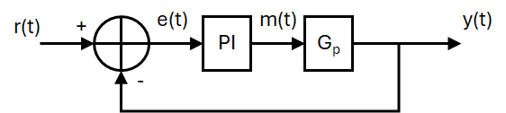
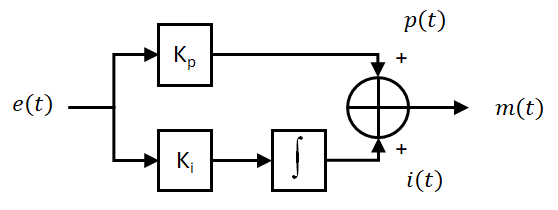

# Controlling the Distance of the robot from a Target

!!! Info "GTA Marking"
    This is an assessed Exercise. When you have completed the <debugHL>[Assessed Exercise](#calibPotEx)</debugHL>, you should show your work to a GTA to get marked.

!!! Note "Before Continuing"
    Before starting these exercises, you should ensure that you have completed all the <debugHL>[Basic Exercises](../BasicExercises/README.md)</debugHL> and have fully constructed the robot chassis, as described in the <debugHL>[Building the Robot](../RobotBuild.md)</debugHL> document.
    
## Introduction

During this exercise you will write a program that will maintain a set distance between the robot chassis from a target. You will implement a closed loop control system with a PI controller, the IR sensor for distance feedback and a PWM actuation signal will be fed to the motor driver board.

The circuit requirements for this exercise is that of the <debugHL>[Motor and Encoder Exercise](../BasicExercises/EncodeMotor.md)</debugHL>.

The following video is a quick demonstration of the final outcome from this exercise:

<figure>
<div style="text-align: center;">
<iframe id="kaltura_player" src='https://cdnapisec.kaltura.com/p/2103181/embedPlaykitJs/uiconf_id/53345422?iframeembed=true&amp;entry_id=1_sf98riu0&amp;config%5Bprovider%5D=%7B%22widgetId%22%3A%221_zed54ef2%22%7D&amp;config%5Bplayback%5D=%7B%22startTime%22%3A0%7D'  style="width: 400px;height: 285px;border: 0;" allowfullscreen webkitallowfullscreen mozAllowFullScreen allow="autoplay *; fullscreen *; encrypted-media *" sandbox="allow-downloads allow-forms allow-same-origin allow-scripts allow-top-navigation allow-pointer-lock allow-popups allow-modals allow-orientation-lock allow-popups-to-escape-sandbox allow-presentation allow-top-navigation-by-user-activation" title="IR Sensor Video"></iframe>
</div>
<figcaption>Video demonstrating the expected outcome from this exercise</figcaption>
</figure>

### The PI Controller Algorithm
PI controllers theory is discussed elsewhere in your course notes from other modules, so will not be comprehensively covered in this section.

A proportional and integral, PI, controller can be used to control the behaviour of a system - in the case the position of the robot chassis. The Pi controller sits within a closed loop control system, as shown in the Block diagram, below:

<figure  markdown="span">
  <a name="closedLoopPI"></a>
  
  <figcaption>Block diagram of the closed loop control system, showing the PI controller.</figcaption>
  </figure>

*Where: $R(t)$ is the reference signal, $e(t)$ is the error signal, $m(t)$ is the manipulated variable and $y(t)$ is the system output, and $Gp$ is the process dynamics of the robot chassis.*

The structure of the PI controller is [shown above](#closedLoopPI), and can be represented with the following time domain equation:

$$
m(t) = \underbrace{K_p\,e(t)}_{\text{Proportional Term, }p(t)}+\space\space\space\space\space\space\overbrace{K_i\int_{-\infty}^\infty e(t)\,dt}^{\text{Integral Term ,}i(t)} \, 
$$

A Block diagram of the above PI control algorithm is [shown below](#PIcontroller):

<figure  markdown="span">
  <a name="PIcontroller"></a>
  
  <figcaption>Block diagram representation of the PI controller.</figcaption>
  </figure>

*Where: $e(t)$ is the error, $p(t)$ is the proportional term, $i(t)$ is the integral term, and $m(t)$ is the manipulated variable. $K_p$ and $K_i$ are the controller gains.

The PI controller algorithm, described in the above equation, cannot be directly implemented on the Arduino, instead, it must be discretized. 

To achaive this, first we split the PI controller into the proportional, p(t), and integral, i(t), components, then discretize the components individually:

The proportional term: $ p(t)=K_p\,e(t)=K_p(r(t)-y(t)) $

This discretizes to: $ p[k]=K_p\,e[k]=K_p(r[k]-y[k]) $, *where: $k$ is the current time step.*

The integral term: $i(t)=K_i\int_{-\infty}^\infty e(t)\,dt \space\space \Longleftrightarrow \space\space \frac{di(t)}{dt}=K_i\,e(t) $

We can use a Backward difference method, to discretize the derivitive function:

$$
\frac{di(t)}{dt}=K_i\,e(t) \space\space \Longleftrightarrow \space\space \frac{i[k]-i[k-1]}{\Delta T}=K_i\,e[n] \space\space \equiv \space\space i[k] = i[k-1]+K_i\,e[n]\,\Delta T
$$

*Where: $\Delta T$ is the sample period for the controller.*

Finally, the manipulated variable, $m[k]$, can be found:
$$
m[k]=p[k] + i[k]
$$

!!! Note
    The integral term is susceptible to a process called integral wind-up <debugHL>reference</debugHL>. To mitigate this effect, the integral term, $i[t]$, can be prevented from exceeding certain bounds, such that, for the case of the Arduino PWM:
    ``` Arduino title="Integral Term Saturation to Prevent Excess Wind-Up"
    if i > 255 {
        i = 255;
    }
    else if (i < -255) {
        i = -255;
    }
    ```
    *Where: `i` is the current integral term, $i[k]$.*

The integral controller can be implemented in function, to improve readability of your main loop, as illustrated in the following example code:

``` Arduino title="Example code for a PI controller function"
int piControllerfunction(float contrKp, float contrKi,
        float contrRef, float contrFB, float deltaT){

    // Calculate the control error
    contrError = contrRef - contrFB;

    // Calculate the proportional term
    float p = contrError * contrKp

    // Calculate the integral term
    float i = iPrev + (contrError * contrKi * deltaT)

    // Bound the integral term to 255
    if i > 255 {
        i = 255;
    }
    else if (i < -255) {
        i = -255;
    }

    // calculate the manipulated variable
    float m = p + i

    // Bound the manipulated variable to 255
    if m > 255 {
        m = 255;
    }
    else if (m < -255) {
        m = -255;
    }

    // Save the integral term for the next iteration
    iPrev = i;

    // Recast the manipulated variable and return its value
    return (int)m;
}
```
!!! Note title "Notes for the above code"
    The above code is a function and should be called periodically from the `main()` function. On the prototype we used a control sample period of 10ms.

    The variable `iPrev` must be declared and initialised in the global variable space, i.e.: `float iPrev = 0;`.

    The variables `contrKp`, `contrKi`, `contrRef`, `contrFB` and `deltaT` must be passed to the function call as floating point variables.


### A Note on Code Timing and Determinacy for Embedded Systems
When implementing a PI controller on an embedded system, it is important to maintain strict timing of the algorithm, to ensure that you are reading the inputs and sensors, and processing the controller algorithm at known times, normally at specific time intervals. Maintaining strict and consistent timing for these ensures that the algorithms you are using function as expected and produce predictable behaviour.

Using `delay()` functions within your code often leads to code that does not have consistent timing, and it is often difficult to predict the code execution time for sections of code. 

To maintain more consistent timing in your code, you should use the millisecond tick timer function, `millis()`, to provide a timing source for your code execution, similar to that used in the <debugHL>[TwoInterruptEncoder.ino example](../BasicExercises/EncodeMotor.md#TwoInterruptEncoder)</debugHL>. In the TwoInterruptEncoder.ino example we use this method for timing the serial monitor printing, in the main loop function, `loop()`.


<a name = "calibPotEx"></a>
## Assessed Exercise

During this exercise you will write a program that will maintain a set distance between the robot chassis from a target. You will implement a closed loop control system with a PI controller, the IR sensor for distance feedback and a PWM actuation signal will be fed to the motor driver board.

**Procedure:**

1. Ensure that you have the completed the building of the robot chassis and the electronic circuit, as described in the <debugHL>[Building the Robot Chassis](../RobotBuild.md)</debugHL> document.
2. A good starting point for the code for this exercise is the assessed exercise you completed for the <debugHL>[Motor and Encoder section](../BasicExercises/EncodeMotor.md#assessed-exercise)</debugHL>

3. The lolly stick should be rained to the vertical position at the start of the exercise demonstration.
4. Write a program that maintains the robot chassis 30cm from a target, (the kit box stood up on its end works well for this):
    1. Uses the IR sensor to measure the distance to the target
    2. The robot chassis should be actuated using the yellow gear motor, with wheel attached, and driven from the driver board.
    3. A PI controller must be used to control the system in closed loop, with the output of the PI controller providing the PWM signal, and setting the BI1 and BI2 inputs to the driver board.
    4. The following controller gains should be used:
        * $K_p = -10$
        * $K_i = -20$
5. Ensure the code you write does not use the `delay()` function to control timing in the main function, `loop()`, instead use the millisecond tick timer function, `millis()`, to provide a timing source for your code execution.
    * On the prototype we used a control sample period of 10ms.
!!! note
    The $K_p$ and $K_i$ values are negative because of the negative slope of the IR sensor response. 
    
    The controller values have been selected to show a slight overshoot when the target is moved, if used with a control sample period of 10ms.

    
### What do we expect to see in the demonstration?

* At the start of the demonstration, your robot chassis should be placed approximately 30cm from the target, (the kit box stood up on its end works well for this).
* On resetting the Arduino, your lolly stick should go to the horizontal position, if it is not already there.
* After a one-second delay, the lolly stick assembly should raise to the vertical position.
* After a further one-second delay, the robot chassis should start to track the position of the target.
* You must show that you have implemented the position control using a PI controller.

!!! Success "Now Get Your Work Marked by a GTA"
    Once you have completed your code and are satisfied with its operation, you should show your work to a GTA for marking.