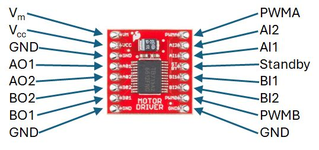

!!! info "GTA Marking"
    This is an assessed Exercise. When you have completed the [Assessed Exercise](#dcMotorExercise), you should show your work to a GTA to get marked.
    

!!! Note
    Before starting these exercises, you should ensure that you have completed the circuit on the robot chassis, as suggested on <debugHL>[Building the Robot: Fig. 13](../RobotBuild.md/#dcMotorPic)</debugHL>. Furthermore, you should ensure that all the connections described in the <debugHL>[Building the Robot: Circuit Layout for the DC Motor Exercise](../RobotBuild.md#dcMotor)</debugHL> are correct.

The following video is a quick demonstration of the final outcome from this exercise:

<figure>
<div style="text-align: center;">
<iframe id="kaltura_player" src='https://cdnapisec.kaltura.com/p/2103181/embedPlaykitJs/uiconf_id/53345422?iframeembed=true&amp;entry_id=1_a3eviyhm&amp;config%5Bprovider%5D=%7B%22widgetId%22%3A%221_4q6vxp1v%22%7D&amp;config%5Bplayback%5D=%7B%22startTime%22%3A0%7D'  style="width: 400px;height: 285px;border: 0;justify-content:center;" allowfullscreen webkitallowfullscreen mozAllowFullScreen allow="autoplay *; fullscreen *; encrypted-media *" sandbox="allow-downloads allow-forms allow-same-origin allow-scripts allow-top-navigation allow-pointer-lock allow-popups allow-modals allow-orientation-lock allow-popups-to-escape-sandbox allow-presentation allow-top-navigation-by-user-activation" title="Placeholder - Quick Test Video"></iframe>
</div>
<figcaption>Video demonstrating the expected outcome from this exercise</figcaption>
</figure>


## Introduction

The aim of this exercise is to control a DC motor from an Arduino, using a DC motor driver interface. You will be using a PWM signal to drive the motor.

### PWM Control for the DC Motor

PWM is a way of encoding information into a rectangular pulse train. Generally, the period, (and hence the frequency), of the pulse train is maintained constant, and the width of the rectangular pulses are varied – we will assume this definition for the remainder of these laboratory sessions. 
<debugHL>[Fig 1](#pwmAverage)</debugHL> illustrated the time domain waveform of the PWM signal, where the digital waveform has a rising edge at t=t<sub>0</sub>, and a falling edge at t=t<sub>2</sub>. The on-state of the PWM signal is defined as t<sub>on</sub>, the off-state of the signal is defined as t<sub>off</sub>, and the PWM period is defined as T<sub>s</sub>.

<figure markdown="span">
  <a name="pwmAverage"></a>
  
  <figcaption>Pulse Width Modulation, (left) time domain waveforms, (rich) average voltage of PWM signal.</figcaption>
  </figure>

PWM can be used in a number of different ways; the most common being to ‘chop’ a DC voltage to reduce its average value, as illustrated graphically in Figure 13. The input voltage, V<sub>in</sub> is ‘chopped’, using a converter circuit, into pulses, as shown in Figure 13 (left), where the time integral of the on-state of the waveform is <debugHL>t<sub>on</sub> x V<sub>in</sub>, </debugHL>and has a graphical area of A. The filtering effect of the system we are driving will effectively spread the area under the pulse across in, <debugHL>[Fig 1 (left)](#pwmAverage)</debugHL> </debugHL>, across the switching period, Ts, as illustrated in <debugHL>[Fig 1 (right)](#pwmAverage)</debugHL>. 

This can be expressed as an integral equation:

<a name="eqn1"></a>
$$
V_{ave} = \frac{1}{T} \int_{t_0}^{t_2} V_{in} dt = \frac{t_{on}} {T_{s}}V_{in}
$$

Where: V<sub>in</sub> is the supply voltage, and V<sub>ave</sub> is the average value of the waveform.

This method of operation is used in most electrical power converters to control the power supply to downstream system, such as a motor.
Another way in which PWM can be used, is to encode some information as a function of the on-state time, t<sub>on</sub>, whilst maintaining a constant switching period, T<sub>s</sub>. The PWM signal is then decoded by the downstream system and a decision is made on its value.

During the laboratory exercises, you will be driving two different types of actuators:

1.	A DC motor - to control the speed of rotation, you will need to control the PWM to regulator the average voltage being fed to the DC motor. To interface the motor to the Arduino, you will need to use a motor drive circuit, to supply the current requirements of the motor.
2.	A standard servomotor - this servomotor will move between 0 and 180 degrees and the angle can be controlled through a 5V pulse signal between 1-2ms and an embedded potentiometer

The DC motor is different from the standard servomotor, in terms of the type of control. For servomotors, the average value of the PWM signal is not being used to regulate the average supply voltage to the device, like it is for DC motors, but instead, the PWM on-time is bounded between 2 values, (1ms and 2ms in this case), and is an encoded signal relating to a rotational position demand parameter for the servomotor, closed loop, controller.

### Code Example: Control LED Intensity Example

In this example, we will use the `analogWrite()` function to generate a PWM signal, which we will use to vary the voltage supplied to an LED, and hence the LED intensity.

A PWM signal can be generated by the `analogWrite()` function. The value passed to the `analogWrite()` function can be between 0 and 255, which results in a PWM output between 0% and 100% duty cycle, as illustrated in <debugHL>[Fig 2](#analoWritePWM)</debugHL>. 


<figure markdown="span">
  <a name="analoWritePWM"></a>
  
  <figcaption>. Illustration of the use of analogWrite() function, and the resulting PWM output.</figcaption>
  </figure>

(<debugHL>[Fig 2](#analoWritePWM)</debugHL> is taken from: <a href = "https://commonpwmAverages.wikimedia.org/wiki/File:Pwm_5steps.gif">https://commonpwmAverages.wikimedia.org/wiki/File:Pwm_5steps.gif</a>)

The Arduino language reference page for the analogWrite command can be found at:
<a href = "https://www.arduino.cc/reference/en/language/functions/analog-io/analogwrite/">https://www.arduino.cc/reference/en/language/functions/analog-io/analogwrite/</a>.

**Procedure:**

1. The circuit requirement for this exercise is the [LED Pattern circuit](../RobotBuild.md#circuit-layout-for-the-led-pattern-and-calibration-of-potentiometer-angle-exercises), so you should have already built thin onto the robot chassis.

2. Use the following example code to run this exercise:

``` Arduino title="LED Fade.ino Example"
//This sketch is the Control LED Intensity Example from the Introduction to
// Arduino – PWM control of Actuators laboratory worksheet

// define a macro for the LED pin number 
#define LEDpin 11

// -------------------------------------
// Setup function
void setup() {
  // define the pin mode for the LED pin
  pinMode(LEDpin, OUTPUT);

}
// -------------------------------------
// Lop Function
void loop() {

  // Increment a variable, i, from 0 and 255
  for (int i = 0; i < 256; i++)
  {
    // modify the PWM signal, by passing the variable, i, to the 
    //analogWrite function
    analogWrite(LEDpin, i);
    //delay the program by 10ms
    delay(10);
  }
  // Decrement a variable, i, from 255 to 0
  for (int i = 255; i >= 0; i--)
  {
    // modify the PWM signal, by passing the variable, i, to the 
    //analogWrite function
    analogWrite(LEDpin, i);
    //delay the program by 10ms
    delay(10);
  }
}
```
3. Run the program and observe the effects on the LED of the different values being passed to the `analogWrite()` function.

## Using the TB6612FNG breakout board

A DC motor cannot be powered directly from the pins of the Arduino board, because the current drawn by the DC motor is too large and could damage the Arduino by overloading the output pins. To overcome this problem, a power electronic driver circuit is required to interface the motor to the Arduino microcontroller board. During this exercise, you will be using a TB6612FNG motor driver breakout board, as shown in <debugHL>[Fig 3](#TB6612FG)</debugHL>, and an external power supply, to drive motor from control signals generated in the Arduino.

<figure  markdown="span">
  <a name="TB6612FG"></a>
  
  <figcaption>Picture of the TB6612FG motor driver board, with pins labelled.</figcaption>
  </figure>

This section is aimed at providing you with some useful information, to help you get started with using the TB6612FNG breakout board. This section will not provide you with all the information you may need, so it will be up to you to research other sources of information to help. There are numerous online guides detailing the interfacing of this breakout board with an Arduino controller.

The TB6612FNG, from TOSHIBA, is a monolithic bridge driver IC, in other words, it is a single integrated circuit containing the power electronic switching and control interface circuitry required for implementing a bridge motor driver circuit. The TB6612FNG contains two independently controlled H-bridge drive circuits. See the data sheet, linked in the following section for more details.

In isolation, an integrated circuit can be difficult to interface with a control system, without a custom PCB design. The use of breakout board circuits provides a convenient way of connecting surface mount chips to breadboard prototyping circuit, and interfacing then with control processors, such as the Arduino devices we will be using. 
The TB6612FNG board, shown in <debugHL>[Fig 3](#TB6612FG)</debugHL>, is a breakout board for the TB6612FNG IC, and is packaged with the required capacitors to correctly operate the device.
The pin descriptions for each pins on the TB6612FNG breakout board are described in <debugHL>[Table 1](#pinsTB6612FG)</debugHL>:

<table>
<a name="pinsTB6612FG"></a>
  <thead>
    <tr> <th>Pin label:</th> <th>Description:</th> </tr>
  </thead>
  <tbody>    
    <tr><td>Vm</td><td>Motor power circuit supply (2.5V to 13.5V)</td> </tr> 
    <tr><td>Vcc</td><td>Logic circuit supply (2.7V to 5.5V)</td> </tr> 
    <tr><td>GND</td><td>Ground</td> </tr> 
    <tr><td>Standby</td><td>Standby input (200kΩ pull-down internally) Low = Standby, High = Active</td> </tr> 
    <tr><td>AI1</td><td>Channel A input 1 (200kΩ pull-down internally)</td> </tr> 
    <tr><td>AI2</td><td>Channel A input 2 (200kΩ pull-down internally)</td> </tr> 
    <tr><td>PWMA</td><td>Channel A PWM input  (200kΩ pull-down at internal)</td> </tr> 
    <tr><td>AO1</td><td>Channel A Output 1</td> </tr> 
    <tr><td>AO2</td><td>Channel A Output 2</td> </tr> 
    <tr><td>BI1</td><td>Channel B input 1 (200kΩ pull-down internally)</td> </tr> 
    <tr><td>BI2</td><td>Channel B input 2 (200kΩ pull-down internally)</td> </tr> 
    <tr><td>PWMB</td><td>Channel B PWM input  (200kΩ pull-down at internal)</td> </tr> 
    <tr><td>BO1</td><td>Channel B Output 1</td> </tr> 
    <tr><td>BO2</td><td>Channel B Output 2</td> </tr> 
  </tbody>
  <caption>Pin descriptions for the TB6612FNG breakout board.</caption>
</table>

### Online Documentation from the manufacturer and other sites

Semiconductor manufacturers often provide information for the use of their manufactured devices in the form of a data sheet, and often provide application notes and other material for more complicated classes of device. Links to some relevant manufacturer’s documentation and some other relevant application documents are provided:

* TB6612FNG Data sheet (TOSHIBA): <debugHL>[TB6612FNG Data sheet](https://toshiba.semicon-storage.com/info/docget.jsp?did=10660&prodName=TB6612FNG){target="_blank"}</debugHL>.
* Data Sheet for the breakout board (Sparkfun): <debugHL>[SparkFun Motor Driver - Dual](https://media.digikey.com/pdf/Data Sheets/Sparkfun PDFs/ROB-14450_Web.pdf){target="_blank"}</debugHL>.
* Application note (ST Microelectronics): <debugHL>[Applications of Monolithic Bridge Driver](https://www.st.com/resource/en/application_note/cd00003776-applications-of-monolithic-bridge-drivers-stmicroelectronics.pdf){target="_blank"}</debugHL>.
* Presentation/Training Material (ST Microelectronics): <debugHL>[An Introduction to Electric Motors](https://www.st.com/resource/en/application_presentation/introduction_to_electric_motors_pres.pdf){target="_blank"}</debugHL>.

## H-Bridge Circuit and Example Code
The TB6612FNG IC is configured to operate as two independent H-bridge circuits, we will only discuss the operation of a single H-bright Circuit, using channel B. The outputs for channel B are BO1 and BO2, and this is controlled using the PWMB signal. The direction of rotation can be configured using the BI1 and BI2 inputs. The operation of an H-bridge circuit is covered in the lecture material for this course, so will not be discussed in detail in this document.

Before proceeding, ensure that you have constructed the H-bridge circuit in <debugHL>[Circuit Layout for the DC Motor Exercise](../RobotBuild.md#dcMotor)</debugHL>.

### Operation of the TB6612FNG Driver Board Circuit

Each H-bridge circuit is configured using two control inputs, In1 and In2, with a separate PWM input for each bridge. The control operation of the H-bridge is described in <debugHL>[Table 2](#ServoMotorConnect)</debugHL>.

<table>
  <a name="ServoMotorConnect"></a>
  <thead>
    <tr> <th colspan="4">Input:</th> <th colspan="3">Output:</th></tr>
  </thead>
  <tbody>
    <tr><td>In1</td><td>In 2</td><td>PWM</td><td>STBY</td><td>Out1</td><td>Out2</td><td>Mode</td></tr>
    <tr><td>High</td><td>High</td><td>High/Low</td><td>High</td><td>Low</td><td>Low</td><td>Brake</td></tr>
    <tr><td rowspan="2">Low</td><td rowspan="2">High</td><td>High</td><td>High</td><td>Low</td><td>High</td><td>Forward (Drive)</td></tr>
    <tr><td>Low</td><td>High</td><td>Low</td><td>Low</td><td>Forward (Freewheel)</td></tr>
    <tr><td rowspan="2">High</td><td rowspan="2">Low</td><td>High</td><td>High</td><td>High</td><td>Low</td><td>Backward(Drive)</td></tr>
    <tr><td>Low</td><td>High</td><td>Low</td><td>Low</td><td>Backward(Freewheel)</td></tr>
    <tr><td>Low</td><td>Low</td><td>High</td><td>High</td><td colspan = "2">OFF (High Impedance)</td><td>Stop (Coast)</td></tr>
    <tr><td>High/Low</td><td>High/Low</td><td>High/Low</td><td>Low</td><td colspan = "2">OFF (High Impedance)</td><td>Standby</td></tr>
    </tbody>
  <caption>Control operation of the H-bridge.</caption>
</table>

In essence, <debugHL>[Table 2](#)</debugHL> indicates that the direction of the motor is configured using the In1 and In2 inputs, (BI1 and BI2, respectively for channel B), and the speed of the motor is controlled with the PWM input, (PWMB for channel B). The standby input is provided to set the driver board into a power sleep state.
!!! Note
    The wiring polarity of the motor power, will define if forward is clockwise or anticlockwise rotation. If the connection of the motor is reversed on Out1 and Out2, then the motor will spin in the opposite direction.

Example code is provided, below, to demonstrate simple operation of this motor. The `analogWrite()` function is used to generate the PWM value for the PWM output, in the following manner:

* 0% duty cycle, (always Low): `analogWrite([PWM pin number], 0)`
* 100% duty cycle, (always High): `analogWrite([PWM pin number], 255)`
* Duty cycle between 0% and 100% be generated by writing values of between 1 and 254 to the `analogWrite()` function.

The Arduino language reference page for the `analogWrite()` function can be found at:
[https://www.arduino.cc/reference/tr/language/functions/analog-io/analogwrite/](https://www.arduino.cc/reference/tr/language/functions/analog-io/analogwrite/){target = "_blank"}

### Sample Code for the TB6612FNG Driver Board

``` Arduino title="Sample Code for the TB6612FNG Driver Board"
// TB6612FNG Driver Board Sample board
//
// Author: Ben Taylor
// University of Sheffield
// Date: September 2024

//
const int pinBI1 = 7;       // Pin allocation for BI1
const int pinBI2 = 8;       // Pin allocation for BI2
const int pinPWM = 5;       // Pin allocation for the PWMB pin

boolean BI1 = 0;            // BI1 pin value
boolean BI2 = 0;            // BI2 pin value
boolean standBy = 0;        // standBy pin Value

boolean rotDirect = 0;      // Rotation direction variable
unsigned char pwmValue = 0; // PWM value to be written to the output

void setup()
{
  // Assign the digital I/O pin directions
  pinMode(pinBI1, OUTPUT);
  pinMode(pinBI2, OUTPUT);
  pinMode(pinPWM, OUTPUT);
 

  //Initialize the serial port
  Serial.begin(9600);

  // Set Initial values for BI1 and BI2 control function pins
  BI1 = 1;
  BI2 = 0;

  // set an initial value for the PWM value
  pwmValue = 200;
}

void loop()
{
  // Write the BI1 and BI2 values to the configuration pins
  digitalWrite(pinBI1, BI1);
  digitalWrite(pinBI2, BI2);

  // Write the pwnValue to the PWM pin
  analogWrite(pinPWM, pwmValue);

  // Display the board variable status to the Serial Monitor
  Serial.print("PWM output value = ");
  Serial.print(pwmValue);
  Serial.print(", Standby = ");
  Serial.print(standBy);
  Serial.print(", BI1 = ");
  Serial.print(BI1);
  Serial.print(", BI2 = ");
  Serial.println(BI2);

  // wait 250ms
  delay(250);
}
```

<a name="dcMotorExercise"></a>
## Assessed Exercise

During this exercise, you will modify the example code 

**Procedure:**

* Copy and Paste the Sample Code for the TB6612FNG Driver Board into a new Arduino sketch.
* Read the code, and inline comments. Run the code, and observe its operation.

* Write a program that can control the speed of the DC motor using a potentiometer input. 
    * The motor should rotate at maximum speed in a clockwise direction, when viewed from the shaft end, when the potentiometer is rotated to the extreme clockwise position.
    * The motor should rotate at maximum speed in an anticlockwise direction, when viewed from the shaft end, when the potentiometer is rotated to the extreme anticlockwise position.
    * When the potentiometer is in the centre position the motor shaft should be at zero speed, (stopped)
    * The speed of the motor should vary in a linear fashion between maximum speed, when the potentiometer is at its extreme rotation, and zero speed when the potentiometer is in the centre position.
    * You should display the following values on the serial monitor terminal, (with a similar text description to the sample code, above):
        1.	ADC measurement value for the Potentiometer input
        2.	PWM value, written to the analogWrite command
        3.	Boolean values for AI1, AI2 and Standby

### What do we expect to see in the demonstration?

* Demonstrate that you have fulfilled the requirements of the exercise with your working system.
* The mapping of the potentiometer to shaft speed is consistent with the description above.
* An external power supply is used to power the motor circuit, (Vm on the driver board).
* ADC measurement from the potentiometer, PWM value and control logic Boolean values are clearly labelled and displayed on the serial monitor.
* The serial monitor should update at a reasonable rate – 2 to 4 times a second.

!!! Success "Now Get Your Work Marked by a GTA"
    Once you have completed your code and are satisfied with its operation, you should show your work to a GTA for marking.