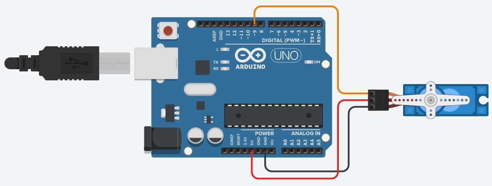
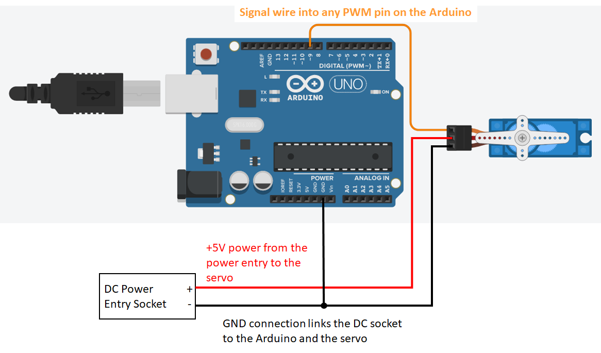
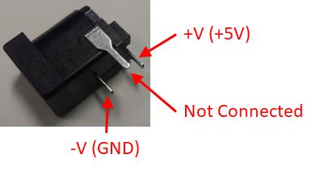

!!! info "GTA Marking"
    This is an assessed Exercise. When you have completed the [Assessed Exercise](#ServoExercise), you should show your work to a GTA to get marked.

!!! Note
    Before starting these exercises, you should ensure that you have completed the circuit on the robot chassis, as suggested on <debugHL>[Building the Robot: Fig. 12](../RobotBuild.md/#dcMotorPic)</debugHL>. Furthermore, you should ensure that all the connections described in the [Building the Robot: Circuit Layout for the Externally Powered Servo Exercise](../RobotBuild.md#dcMotor) are correct.


The following video is a quick demonstration of the final outcome from this exercise:

<figure>
<div style="text-align: center;">
<iframe id="kaltura_player" src='https://cdnapisec.kaltura.com/p/2103181/embedPlaykitJs/uiconf_id/53345422?iframeembed=true&amp;entry_id=1_a3eviyhm&amp;config%5Bprovider%5D=%7B%22widgetId%22%3A%221_4q6vxp1v%22%7D&amp;config%5Bplayback%5D=%7B%22startTime%22%3A0%7D'  style="width: 400px;height: 285px;border: 0;justify-content:center;" allowfullscreen webkitallowfullscreen mozAllowFullScreen allow="autoplay *; fullscreen *; encrypted-media *" sandbox="allow-downloads allow-forms allow-same-origin allow-scripts allow-top-navigation allow-pointer-lock allow-popups allow-modals allow-orientation-lock allow-popups-to-escape-sandbox allow-presentation allow-top-navigation-by-user-activation" title="Placeholder - Quick Test Video"></iframe>
</div>
<figcaption>Video demonstrating the expected outcome from this exercise</figcaption>
</figure>

## Introduction
The aim of this exercise is to demonstrate the control of a position control servo, in this case the MG90 servomotor. The MG90 is a very low power servo motor and can be driven directly from the Arduino board power supply.

### Controlling a Standard Servomotor directly from the Arduino. (Informal Exercise) ###
<a name="mg90Servo"></a>

!!! Info "Transitioning to MG90 Servo Motors"
    We are transitioning away from SG90 servos due to robustness issues and replacing these with MG90 servos. Some of you may still find that you have an SG90 servo in your kit – this is OK, you can use this device with same wiring, fixtures, and code.

The MG90 is a very low power servo motor and can be driven directly from the Arduino board power supply, without the need for an external supply. If you attempt this with the MG996 servo, you may find that the current draw is too great, and this may cause glitches in the power supply lines that cause the Arduino to "<debugHL>[Brownout reset](https://www.allaboutcircuits.com/technical-articles/what-is-brown-out-reset-microcontroller-prevent-false-power-down/ "Link to an article on the All About Circuits website")</debugHL>”. For the remainder of this exercise, we will use the MG90.

!!! Note "Note on the following Informal Exercise"
    The exercise is a legacy exercise from a previous iteration of this course and required an unconnected Arduino and a MG90 servo, i.e. not connected into your robot chassis, as shown in <debugHL>[Fig. 1](#simpleServo)</debugHL>.

    This exercise is not manditory, but provides you with a code example for the operation of a standard servo motor, and the code is applicable for both the MG90 and the larger MG996. This example code, provided, can form the basis of the assessed exercise for the servo integrated onto the robot chassis.

During this exercise, we will use the circuit shown in <debugHL>[Fig. 1](#simpleServo)</debugHL>, where:

* The red wire of the servo is the positive supply, and is connected to the 5V if the Arduino
* The brown wire is the negative supply and should be connected to the ground line.
* The orange wire is the control line and should be connected to a PWM enabled I/O pin on the Arduino board, in this example, pin 9.


<figure markdown="span">
  <a name="simpleServo"></a>
  
  <figcaption>Circuit diagram for this Exercise.</figcaption>
  </figure>

!!! Info
    Connecting the wires directly into the servo connector will result in a weak mechanical connection. This connection should be sufficient for this exercise, but if you wish for a more robust connection, you can push the male header pins into the breadboard and use this as intermediate connection.

**Procedure:**

1.	Connect the circuit shown in <debugHL>[Fig. 1](#simpleServo)</debugHL>.
2.	Download the <debugHL>[Standard_Servo_Example.ino](https://drive.google.com/uc?id=12UGk72jEbWFEJZEG9WvTIxJYWdE80f4-)</debugHL> code from the Blackboard folder for this practical. Also included below:


*Arduino code for the Standard_Servo_Example.ino Example*
``` Arduino
// This Example code is for use with the Controlling a Standard Servomotor exercise
//

// Include the servo library to allow for connection and control of servo motors
#include <Servo.h>

// define the macro pinServo1 as 9, to use for connecting the servo to pin 9
#define pinServo1 9

// Declare a servo motor class variable servo 1
Servo servo1;

// -------------------------------------
// Setup function
void setup()
{
  // "attach"  servo 1 to the defined pin
  servo1.attach(pinServo1);

  // set the neutral, centre, position for the servo
  servo1.write(90);

  // Alternte command for setting the neutral position
  //servo1.writeMicroseconds(1500);

  // wait until the servo has moved into position, (1000ms is more time than needed)
  delay(1000);
}

// -------------------------------------
// Loop Function
void loop()
{
  // start from the nuetral position, (90 degrees from the fully clockwise position)
  servo1.write(90);
  //servo1.writeMicroseconds(1500);  // Alternate Command

  // wait until the servo has moved into position
  delay(1000);

  // move to  0 degrees, (fully clockwise)
  servo1.write(0);
  //servo1.writeMicroseconds(500);  // Alternate Command

  // wait until the servo has moved into position
  delay(1000);

  // move to 180 degrees, (fully anti cloclwise position)
  servo1.write(180);
  //servo1.writeMicroseconds(2500);  // Alternate Command

  // wait until the servo has moved into position
  delay(1000);
}
```

Looking at the code, above, you will see that the servo library had been included in the sketch. This external is library containing several functions that allow the Arduino to control a variety of servo motors. The Arduino reference library webpage for the servo library is located here:

<debugHL>[https://www.arduino.cc/reference/en/libraries/servo/](https://www.arduino.cc/reference/en/libraries/servo/ "Arduino reference library webpage for the servo library")</debugHL>

Before you can use the servo control commands in your code, you must first perform the following operations in your code, (look at the code to see how this has been done):

* In the global namespace area:
    * Include the servo library `Servo servo1;`
    * Declare a servomotor class variable. This is used by the Arduino IDE to direct your commands to the correct servo motor.
* In the `setup()` function:
    * The servo motor class needs to be linked to an output pin. This is achieved using the `attach()` function. 

In Standard_Servo_Example.ino we have declared a servo class variable as `servo1`, we have defined I/O pin 9 as the servo control pin, and we attached the `servo1` class to pin 9, using the following command: `servo1.attach(pinServo1);`

The servomotor is controlled using an encoded PWM signal. The on time of the PWM signal should be bounded between 1000μs and 2000μs, with a pulse repetition rate between 40 and 200Hz, i.e. a period between 5ms and 25ms.

The servo centre position, or ‘neutral’ position, of the servo is commanded using a 1500μs pulse width. Typically, the 90° clockwise position is commanded with a pulse width of approximately 500μs, and the 90° anticlockwise position is commanded with a pulse width of approximately 2500μs. These 90° position pulse widths are often slightly different for each servo model, so you may need to refine these timings for servos you have been provided.

The servo library has two functions for controlling the position of the servo:

* `write()`, which directly commands the servo angle.
* `writeMicroseconds()`, which commands a specifically timed pulse width for the servo output.

The `write()` function may not be accurate for the servomotors you have been provided, and may vary between different models. You should investigate the accuracy of these commands when using the `write()` and `writeMicroseconds()` for applications which require accurate output angles.

<ol start=3>
  <li>Look at the Standard_Servo_Example.ino code, and see how the servo library has been used, how a servo is declared and attached to the system.</li>
  <li>Run the sketch and observe its operation</li>
</ol>

### Controlling a Standard Servo with an External Power Supply

The previous exercise demonstrates how to connect and power a small servo directly from the pins of the Arduino device. When operating with several small servos, or one or more larger servos, the power supply from the Arduino will not be capable of providing the power supply requirements for this load. This may result in the servos not working at all, or unpredicted system behaviour, due to <debugHL>[Brownout reset](https://www.allaboutcircuits.com/technical-articles/what-is-brown-out-reset-microcontroller-prevent-false-power-down/ "Link to an article on the All About Circuits website")</debugHL>.

This section will show how to power the servos from an external power supply, while controlling them from the Arduino.

The SG90 is a very low power servo motor and can be driven directly from the Arduino board power supply, as shown in <debugHL>[Fig. 1](#simpleServo)</debugHL>.

If we wish to connect a larger servo to the system, then we must use an external power supply to power the servo, as illustrated in <debugHL>[Fig. 2](#ServoExternalPower)</debugHL>. In <debugHL>[Fig. 2](#ServoExternalPower)</debugHL>, we can see that the red, +5V line is supplied from the external power supply, and the GND line of all the elements, Arduino, power entry socket, and servo are linked. This is to ensure that all the circuit elements are referenced to the same voltage.

<figure markdown="span">
  <a name="ServoExternalPower"></a>
  
  <figcaption>Wiring diagram for the servo powered from an external power supply.</figcaption>
  </figure>

  The pin connections for the external power supply connector, (provided in the mechatronics kit box), are shown in <debugHL>[Fig. 3](#dcPower)</debugHL>.

<figure markdown="span">
  <a name="dcPower"></a>
  
  <figcaption>Annotated picture of the external power supply connector pins.</figcaption>
  </figure>

### Linear mapping of a Value to a Measurement

In some cases a sensor measurement can be linearly mapped from an input variable to a meaningful measurement value. In this case, we can map the ADC measurement value from the potentiometer, between 0 and 1023, into a servo angle between 90° and 0°, i.e. the lolly stick between horizontal and vertical.

The map function can be used to provide a linear calibration/mapping between a measured value and a real world parameter. In this exercise, you will use the ADC measurement value as the input to a `map()` function and use it to provide the linear command for the servomotor output.

!!! Info "`map()` function"
    See the `map()` function page from the Arduino language reference pages for a description: <debugHL>[https://docs.arduino.cc/language-reference/en/functions/math/map/](https://docs.arduino.cc/language-reference/en/functions/math/map/){target="_blank"}</debugHL>


<a name = "ServoExercise"></a>
## Assessed Exercise: Driving the MG996 Servo on the front of the Robot Chassis

!!! Note "Before Starting This Exercise"
    Ensure that you have the servo and the external power supply connected, as described in the <debugHL>[Electrical Connections section of the Building the Robot](../RobotBuild.md#ElecConn)</debugHL> Document

The aim of this exercise is to demonstrate that you can operate a standard servo powered from an external supply, and reset the servo to the null position. 

**Procedure:**

* Before starting this exercise, you will need to remove the <debugHL>[lolly stick assembly](../RobotBuild.md#LollyAss "Jump to the 'Assembling the Lolly Stick D Assembly' section of the Building the Robot Chassis document")</debugHL> from the MG996 servo on the robot chassis
* Write a program to reset the servo to the null position, using the command: `servo1.write(90);`
* While the servo is in the null position, reattach the <debugHL>[lolly stick assembly](../RobotBuild.md#LollyAss "Jump to the 'Assembling the Lolly Stick D Assembly' section of the Building the Robot Chassis document")</debugHL>, with the arm as close to horizontal as the servo shaft will allow.
* Write a 2nd program, (the assessed part), to perform the following:
    * When the Arduino is reset, or initially programmed, the servo arm (lolly stick assembly) should reset to the horizontal position.
        * You will need to adjust the initial angle of the servo in code to achieve this, because `servo1.write(90);` will not quite achieve this.
    * The servo position should remain commanded to horizontal for 1 second
    * The servo arm should then raise to the vertical position and maintain this position for 1 second.
    * Repeat the above horizontal to vertical process once.
    * After a further 1 second delay, the lolly stick angle should track the potentiometer input:
        * ADC value, 0 to 1023 maps a to servo angle of approximately 90° to 0°, maps between horizontal to vertical

!!! Note
    You will need to adjust the map angles to get the servo to a position as close to horizontal and vertical as possible. 90° servo demand is not exactly horizontal and 0° servo demand is not exactly vertical.

The power supply of your servo **MUST** be supplied from the external power supply and not the Arduino +5V. The GND of the Arduino, external supply and servo must be connected to the same node.

!!! Danger "Danger: You can destroy your Laptop motherboard if you get this wrong"
    If you connect the +5V supply of the Arduino and the external power supply together you risk destroying the motherboard of your laptop by sending a voltage spike up the USB lead when the servo operates.

    Read the [Disclaimer](../Disclaimer.md) document before proceeding.

    The University or MEE take no responsibility for damaged laptops due to this issue. We recommend using the University IT equipment to mitigate damaging your equipment.


### What do we expect to see from your demonstration?

Your Servo must be powered from the external power supply during this exercise.

* When the Arduino is reset, or initially programmed, the servo arm (lolly stick assembly) should be set as close to horizontal as possible.
    * You will need to adjust the initial angle of the servo in code to achieve this.
* The servo should wait 1 second before raising to as close to the vertical position as possible.
* The servo should wait 1 second before dropping to the horizontal position.
* The servo should wait 1 second before raising again to the vertical position.
* After 1 second, the servo should track the servo position, such that:
    * When the potentiometer is in the far right position, the lolly stick is horizontal.
    * When the potentiometer is in the far left position, the lolly stick is vertical.
    * The lolly stick position tracks the potentiometer with a linear mapping.


!!! Success "Now Get Your Work Marked by a GTA"
    Once you have completed your code and are satisfied with its operation, you should show your work to a GTA for marking.
