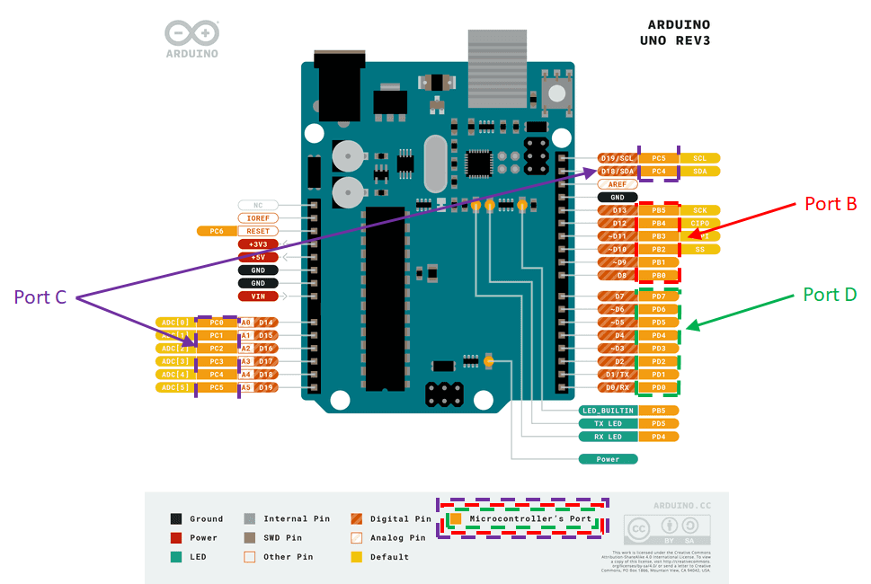

# Interfacing the Incremental Encoder from the Gear Motor
!!! info "GTA Marking"
    This is an assessed Exercise. When you have completed the [Assessed Exercise](#encoderExercise), you should show your work to a GTA to get marked.
    

!!! Note
    Before starting these exercises, you should ensure that you have completed the circuit on the robot chassis, as suggested on <debugHL>[Building the Robot: Fig. 15](../RobotBuild.md/#EncoderPic)</debugHL>. Furthermore, you should ensure that all the connections described in the <debugHL>[Building the Robot: Circuit Layout for the Encoders and Motor Exercise](../RobotBuild.md#Encoder)</debugHL> are correct.

The following video is a quick demonstration of the final outcome from this exercise:

<figure>
<div style="text-align: center;">
<iframe id="kaltura_player" src='https://cdnapisec.kaltura.com/p/2103181/embedPlaykitJs/uiconf_id/53345422?iframeembed=true&amp;entry_id=1_a3eviyhm&amp;config%5Bprovider%5D=%7B%22widgetId%22%3A%221_4q6vxp1v%22%7D&amp;config%5Bplayback%5D=%7B%22startTime%22%3A0%7D'  style="width: 400px;height: 285px;border: 0;justify-content:center;" allowfullscreen webkitallowfullscreen mozAllowFullScreen allow="autoplay *; fullscreen *; encrypted-media *" sandbox="allow-downloads allow-forms allow-same-origin allow-scripts allow-top-navigation allow-pointer-lock allow-popups allow-modals allow-orientation-lock allow-popups-to-escape-sandbox allow-presentation allow-top-navigation-by-user-activation" title="Placeholder - Quick Test Video"></iframe>
</div>
<figcaption>Video demonstrating the expected outcome from this exercise</figcaption>
</figure>

## Introduction and Background

Rotary sensors are used to measure the position and/or speed of a rotating body, (generally a shaft), and can either have an analogue or digital output. The term rotary encoder generally described a digital rotational position sensor. 

Rotary position encoders come in two different types:

1.	Absolute position encoder: This class of devices will indicate the absolute position of a rotating body. This measurement does not require an initial position reference. 
2.	Incremental position encoder: This class of device will indicate the position of the rotating shaft, relative to an initial position or index point. Absolute position can be obtained by knowing the exact initial position, at start-up, or index point, (if the device has an index pulse).

The following link will provide you with some further insight into rotary position encoders:

<a href = "https://en.wikipedia.org/wiki/Rotary_encoder">https://en.wikipedia.org/wiki/Rotary_encoder</a>

Rotary speed can be measured by a rotary shaft encoder, often called a tachometer – we will not further discuss these devices in this document. Shaft speed can be calculated from the position encoder, by measuring the displacement of a rotary shaft and dividing this by the time interval between measurements.

The sensing technologies for position encoders varies between devices, but the two most common are optical and magnetic. The incremental encoder used on the FIT0450 gear motor, (contained within the Mechatronics kit), is a magnetic quadrature encoder. This is a specific type of incremental encoder called a quadrature encoder and has two square wave outputs, A and B, both offset by 90°, as illustrated in <debugHL>[Fig 1](#encoderAandB)</debugHL>.

<figure markdown="span">
  <a name="encoderAandB"></a>
  
  <figcaption>Example of the quadrature encoder output.</figcaption>
  </figure>

Figure 20 shows the quadrature encoder attached to the FIT0450 gear. This device has a 120:1 gear box attached between the motor and the output shaft. There is a quadrature encoder, comprising of an 8 pole-pair magnetic disc, attached to the back of the motor shaft, and 2 offset Hall effect switch sensors, mounted to the motor body.

!!! info title "What is the difference between a sensor and a switch sensor?"
    With an analogue sensor device, the output of the device is a continuous variable quantity and may require signal conditioning before the output can be read by a microcontroller. In the case of a switch sensor, the output is either a LOW or HIGH digital level, and the switch sensor contains all or most of the signal conditioning required to interface with a microcontroller.

<figure markdown="span">
  <a name="encoderPic"></a>
  
  <figcaption>Connections between the encoder and the Arduino and components of the encoder.</figcaption>
  </figure>

As the disk rotates, each time a north pole of the magnet passes a Hall effect switch, the output changes from 0 to 1 and back to 0 when the south pole passes. This results in a square wave output from the Hall effect switch as the shaft rotates. The encoder has two Hall outputs, A and B, one for each Hall effect switch sensor. The sensors are offset 90°, (electrically), around the circumference of the disk, consequently, outputs A and B are 90° out of phase with respect to each other, as shown in <debugHL>[Fig 1](#encoderAandB)</debugHL>. This difference in phase is crucial in determining the direction of rotation of the disc, such that, output A will lead B in one direction and output B will lead A in the other.

The number of magnetic sections of the disc determines the number of “pulses per revolution”, which is a characteristic of each encoder. This is important in determining the minimum detectable angle of rotation and, therefore, the accuracy of the system overall. 

As mentioned above, there are 8 magnetic pole pairs on the disk, consequently, there are 8 pulses on the output of each sensor for one revolution of the magnetic disk. The motor has a 120:1 gear box, therefore, for one rotation of the output shaft there will be $8\times120=960$ pulses on the output of each sensor (or $960\times4$ digital edges). The positional accuracy of the encoder is, therefore, 960 pulses per revolution, or:

$$
 \frac{360°}{960 \space pulses \space per \space revolution} = 0.375° \space per \space pulse.
$$

When using a quadrature encoder with a microcontroller, the rotation of the encoder can be fast, leading to high frequency pulses. As a result, trying to read the states of the encoder outputs in the Arduino loop function is not a reliable method for reading the quadrature encoder. If the microcontroller is busy executing other instructions when the pin’s state changes, then the pulse is not counted, resulting in a mismatch between the real angle and the software measurement. A much more reliable way of acquiring the outputs A and B is through a special feature of the microcontroller called an interrupt. The interrupt module can be used to sense an event on a digital input, (in this case the encoder output), and run a special piece of code, to “service” the interrupt. This special piece of code is called an interrupt service routine, or ISR.

In the case of reading the quadrature encoder, we use a level change interrupt on the pins of the microcontroller, attached to the quadrature encoder. Each time there is a level transition in either output A or B, the main code is interrupted and the ISR is run by the microcontroller. This means that whatever the microcontroller is busy doing, the execution is stopped to process the interrupt, and no pulses are lost.

There several ways of using the interrupts to measure the encoder outputs. For maximum resolution, two interrupts are required, but a single interrupt can be used to produce a position resolution of half this resolution. 

The method, illustrated in <debugHL>[Table 1](#EncoderBits)</debugHL>, uses a counter to track the “pulse” position of the encoder, and two interrupts for the two inputs, A and B. One ISR is attached to the A pin interrupt and processes the event associated with a change in the A input value, and similarly, there is an ISR for input pin B.
Table 3 illustrates the operation of the two ISR servicing the A and B pin interrupts. When an encoder interrupt occurs on either pin A or B, the pin values are compares and the counter value is either incremented or decremented, depending on the A and B pin values and the logical function described in <debugHL>[Table 1](#EncoderBits)</debugHL>. <debugHL>[Table 1](#EncoderBits)</debugHL> also shown which ISR each line of the table is processed.

<a name="EncoderBits"></a>
<table>
  <thead>
    <tr> <th>ROTATION:</th><th>OUTPUT A:</th><th>OUTPUT B:</th><th>Which ISR?</th><th>COUNT:</th> </tr>
  </thead>
  <tbody>
    <tr> <td rowspan = "4">CW</td><td>0→1</td><td>0</td><td>A</td><td>+1</td> </tr>
    <tr> <td>1</td><td>0→1</td><td>B</td><td>+1</td> </tr>
    <tr> <td>1→0</td><td>1</td><td>A</td><td>+1</td> </tr>
    <tr> <td>0</td><td>1→0</td><td>B</td><td>+1</td> </tr>
    <tr> <td rowspan = "4">CCW</td><td>0→1</td><td>1</td><td>A</td><td>-1</td> </tr>
    <tr> <td>1</td><td>1→0</td><td>B</td><td>-1</td> </tr>
    <tr> <td>1→0</td><td>0</td><td>A</td><td>-1</td> </tr>
    <tr> <td>0</td><td>0→1</td><td>B</td><td>-1</td> </tr>
  </tbody>
  <caption>Control operation of the H-bridge.</caption>
</table>

The following code snippet is a framework to setup pins D2 and D3 as digital inputs and assign each one an interrupt service routine, `ChannelA()` and `ChannelB()`, respectively.

The code provided, below, is a framework to set up the interrupt capable, digital input pins for the Arduino Uno, D2 and D3. The functions `ChannelA()` and `ChannelB()` are declared as ISRs using the `attachInterrupt()` function.

```Arduino title="How to setup The D2 and D3 pins as interrupt capable"
#define PINA 2 // A output of the  encoder attached to PIN 2 of the Arduino
#define PINB 3 // B output of the  encoder attached to PIN 3 of the Arduino

volatile long enc_count = 0; // Pulse count from the quadrature encoder

void setup(){
  // Initialize the A and B input pins
  pinMode(PINA, INPUT);
  pinMode(PINB, INPUT);

  // Attach interrupt to PINA. When the pin changes state, the function 
  // channelA() is called.
  attachInterrupt(digitalPinToInterrupt(PINA),channelA, CHANGE);
  // Attach interrupt to PINB. When the pin changes state, the function 
  // channelB() is called.
  attachInterrupt(digitalPinToInterrupt(PINB),channelB, CHANGE);

}

void loop() {
...
}

void ChannelA(){
...
}

void ChannelB(){
...
}
```
See the following link for a fuller description of the attachInterrupt() function:

<debugHL>[https://www.arduino.cc/reference/tr/language/functions/external-interrupts/attachinterrupt/](https://www.arduino.cc/reference/tr/language/functions/external-interrupts/attachinterrupt/){target="_blank"}</debugHL>

We use the CHANGE option with the attachInterrupt() function to ensure that the interrupt is generated for both rising and falling transitions of the interrupt pins, A and B.

Note: the enc_count variable has been declared as “volatile”. This is required for variables that will be changed in an ISR, because the memory storage needs to be handled slightly differently for that usage of variables. See the following link for more details:

<debugHL>[https://www.arduino.cc/reference/en/language/variables/variable-scope-qualifiers/volatile/](https://www.arduino.cc/reference/en/language/variables/variable-scope-qualifiers/volatile/){target="_Blank}</debugHL>

!!! Note title "Note Regarding Interrupt Pins on the Arduino"
    On the Arduino UNO, only pins D2 and D3 can be used with the attachInterrupt() function. On an Arduino Mega, pins D2, D3, D18, D19, D20, D21 are available (D20 and D21 cannot be used if I2C is used used (I2C is a communication protocol for some specific sensors; not among those in the Mechatronics kit)). 

Before attempting to control the rotation of the shaft of a DC motor, you should convert the encoder output into a useful value, suggestions are output shaft revolutions or wheel angle. The following equations can be used to calculate these values:

$$
shaft \space revolutions=\frac{pulse \space count}{pulses \space per \space revolution}
$$

If the angle is required instead:

$$
shaft \space revolutions=360°\times\frac{pulse \space count}{pulses \space per \space revolution}
$$

!!! note title "Remember"
    The above Equations relate to complete pulses on each data line. The presented code will increment a counter for each digital edge on both A and B data lines, therefore, the shaft ravolutions and the shaft angle will be quarter of the calculated value, using the code templates provided.

## Reading the Output of the Incremental Encoder
The aim of this exercise is to read the encoder position and display this on the serial monitor.

Before starting, you should ensure that all the connections described in the <debugHL>[Building the Robot: Circuit Layout for the Encoders and Motor Exercise](../RobotBuild.md#Encoder)</debugHL> are correct.

<a name="TwoInterruptEncoder"></a>
``` Arduino title="TwoInterruptEncoder.ino Example Code Template"
#define ENC_K [Insert the value for the FIT0450 Gearmotor] //Number of edges
//  per revolution of the output shaft
#define PINA 2 // A output of the quadrature encoder attached to PIN 2
#define PINB 3 // A output of the quadrature encoder attached to PIN 3

//These two variables are declared as volatile because they are updated
// within an ISR
volatile long encCount; // Pulse count from the quadrature encoder
volatile float wheelAngle; // Angle of the output shaft of the gear motor,
// attached to the wheel

// initialise the lastDisplay variable
long lastDisplay = 0;
#define delayDisplay 250

void setup() {
  Serial.begin(9600);
  pinMode(PINA, INPUT);

  // Attach interrupt to PINA. When the pin changes state, the function channelA()
  // function is called.
  attachInterrupt(digitalPinToInterrupt(PINA),channelA, CHANGE);

  // Attach interrupt to PINB. When the pin changes state, the function channelB()
  // function is called.
  attachInterrupt(digitalPinToInterrupt(PINB),channelB, CHANGE);

  encCount = 0;
  wheelAngle = 0;
}

void loop() {

  // Update the Serial Monitor every 250ms
  if (millis() >= lastDisplay + delayDisplay) {
  
    // update lastDisplay to the current millis() time
    lastDisplay = millis();

    // construct the serial monitor messages
    Serial.print("Encoder Pulse Count = ");
    Serial.print(encCount);
    Serial.print("Wheel angle = ");  
    Serial.print(wheelAngle);
    Serial.println("°");
  }
}

void channelA() {
// Use if else statements to increment or decrement the encCount variable
// Use information in the table in the Encoder section of the The Rotary 
// Position Encoder section of the laboratory Documentation.
// Focus on the table rows where Output A is changing
// Use digitalread() to acquire the states of PINA and PINB

  if([insert a logic statement here]) {
    if([insert a logic statement here]){
      encCount++; // Encoder rotating in one direction, e.g. clockwise
    }
    else {
    // Encoder rotating in the opposite direction, e.g. counter clockwise
    encCount--; 
    }
  }
  else{
    if([insert a logic statement here]){
      encCount++; // Encoder rotating in one direction, e.g. clockwise
    }
    else {
    // Encoder rotating in the opposite direction, e.g. counter clockwise
    encCount--; 
    }
  }  

  //compute the angle of rotation of the wheel using the pulse count, encCount
  wheelAngle = ; 

}
void channelB() {
  // Use function channelA() as a template
  // This time focus on the rows of the table where Output B is changing
}
```
!!! note title "Remember"
    This Interrupt Method counts the digital edges of the A and B signals, not the number of pulses. As a result, there are $4\times$ the number of edges to pulses, therefore, the output count will be $4\times$ greater than the number of pulses.

<a name="encoderPosition"></a>
## Reading the Rotary Encoder Exercise


The aim of this exercise is for you to develop the Encoder Read functionality before you attempt to use the encoders in conjunction with actuating the motor.

This is a non-assessed exercise, but it is strongly recommended that you complete this exercise before proceeding, because it provides you with the first half of the requirements for the <debugHL>[Assessed Exercise](#encoderExercise)<debugHL>.

**Procedure:**

1. Copy and paste the code provided, above, into a new Arduino sketch.
2.	The code for the pin A ISR, channelA(), is partially completed. You should implement the logic function for the A interrupt illustrated in <debugHL>[Table 1](#EncoderBits)</debugHL>.
3.	Use your working for the `ChannelA()` code to write the code for the `ChannelB()` function.
4.	Modify the code to update the serial monitor display every 250ms.
5. Ensure that you have set the `ENC_K` value to the number of digital edges per revolution, not number of pulses
6. Run your code and rotate the motor wheel. The Serial Monitor should display the correct values.

!!! Note "Stop Using the `Delay()` Function"
    For the timing of the serial monitor, you should use the millis() method in the TwoInterruptEncoder.ino template file, and not use the delay() method. Inserting delay functions into your code is bad practice and can cause problems during future development.

<a name="encoderExercise"></a>
## Assessed Exercise

The aim of this exercise is to measure the wheel angle of the gear motor, using the quadrature encoder, and move the wheel angle to a series of desired locations.
During this exercise you will be required to integrate the code form:

* The <debugHL>[Reading the Rotary Encoder Exercise](#encoderPosition)</debugHL>, above
* The <debugHL>[DC Motor: Assessed Exercise](./DcMotor.md#dcMotorExercise)</debugHL>

**Procedure:**

Write a program that can rotate the wheel connected to the DC motor according to the following cycle:

1.	From an initial starting point, rotate the wheel 45° clockwise
2.	Wait for 1 second
3.	Rotate the wheel 45° anticlockwise (back to the starting position)
4.	Wait for 1 second
5.	Rotate the wheel 90° clockwise
6.	Wait for 1 second
7.	Rotate the wheel 90° anticlockwise
8.	Wait for 2 seconds, then repeat the sequence.
9.	On the serial monitor, you should display: 
    * The time in seconds from the start of the demo
        * You should calculate this, not use the serial monitor time stamp
    * The PWM output to the motor
    * The shaft position of the motor in degrees.

### What do we expect to see in the demonstration?

* Demonstrate that you have fulfilled the requirements of the exercise with your working system.
* The rotational sequence for the output shaft as described above.
* An external power supply is used to power the motor circuit, (Vm on the driver board).
* Demonstration time in seconds, motor PWM value, control logic Boolean values to the driver board, and the motor shaft angle, are clearly labelled and displayed on the serial monitor.
* The serial monitor should update at a reasonable rate – 2 to 4 times a second.

!!! Success "Now Get Your Work Marked by a GTA"
    Once you have completed your code and are satisfied with its operation, you should show your work to a GTA for marking.

## Advanced Exercise: Reading multiple encoders efficiently. (Non-Assessed)

!!! Note

Note: This is a formative exercise and will not be assessed, but you may find it useful to complete, to help you with your group project.

The aim of this exercise is to use the pin change interrupt on one of the input ports of the microcontroller, instead of the dedicated interrupt pins. (***Note:** this is a feature of AVR microcontrollers and may not be available on all devices or may be implemented slightly differently.*)

When controlling a mobile robot, it is usually necessary to read more than one encoder. Unfortunately, when using an Arduino UNO, the `attachInterrupt()` instruction can only be used with digital pins D2 and D3. Moving to a board with more I/Os, such as the Mega, solves the problem to some degree. Still, when dealing with a larger number of encoders, a more general approach may be required. 

A simple and efficient way of acquiring two or more encoders, is to use the pin change interrupts. The pins on a microcontroller are grouped in ports. On typical Arduino boards each port consists of up to 8 pins. These can be found by looking at a pinout diagram for the board in use, such as shown for the Arduino Uno in <debugHL>[Fig 4](#arduinoPinout)</debugHL>.

<figure  markdown="span">
  <a name="arduinoPinout"></a>
  
  <figcaption>Pinout of the Arduino UNO board.</figcaption>
  </figure>

In this exercise, you will consider the Port D pins on I/O D0 to D7, as illustrated in <debugHL>[Fig 4](#arduinoPinout)</debugHL>.

!!! Note title "Note:"
    This method does not use the Arduino libraries to use the interrupts. Instead, you will be interfacing with the microcontroller control resisters directly, unlike the interrupt pins method shown in Exercise 2, which uses the pre-build Arduino libraries.

In order to use the pin change interrupts, you will need to:

* Determine which pins we wish to attach an interrupt to perform our operation.
    * Ideally this would be from a single port.
* Enable the pin change interrupt for the port you wish to use.
* Select the pins we wish to use.
* Edit the associated interrupt service routine, ISR.
    * In your ISR, you will need determine which pin(s) has changed state and work accordingly.

This process is explained in more depth in the <debugHL>[DroneBot Workshop article](https://dronebotworkshop.com/interrupts/){target="_blank}</debugHL>.

The advantage of using this more advanced approach is that any pin on the microcontroller can be used to read encoder outputs, dramatically increasing the number of encoders that can be used in a system.
Let us consider a system with two encoders attached to an Arduino Uno on pins D3, D4, D5, and D6, for the encoder 1 A & B pins and the encoder 2 A & B pins, respectively. As can be seen from <debugHL>[Fig 4](#arduinoPinout)</debugHL>, all these pins are part of Port D on the Arduino Uno.

The code below shows a snippet of code outlining a basic framework of how to initialise this process:

1. Activate the pin change interrupts for PORT D, using the command: `PCICR |= 0b00000100;`
2.	Reset the port D pin change mask to ensure correct operation: `PCMSK2 = 0;`
3.	Select the interrupt pins of interest from the port D interrupt mask register: `PCMSK2 |= 0b01111000;`

The masking operation tells the microcontroller which pins it needs to listen to and which pins to ignore. This operation is needed to avoid the interrupt being triggered by changes in pins that are not connected to the encoders.

``` Arduino title="Basic framework for the pin change interrupt method, (code snippet)"
void setup()
{
  PCICR |= 0b00000100;
  PCMSK2 = 0;
  PCMSK2 |= 0b01111000;

}

void loop()
{
  // Put your main code here, to run repeatedly:
}

// This is the interrupt service routine for the Port D pin change interrupt
// Nore: you cannot define the name for this ISR
ISR (PCINT2_vect){

}
```

The interrupts are now only active on the 4 pins connected to the encoders, D3 to D6. When one of the pins changes its state, the function ISR(PCINT2_vect) is automatically executed. ***Note:** PCINT2_vect is the interrupt request handler for PORT D and is required code work for the ISR.*

One method to measure the output of the attached encoders is to define a look-up table to modify the encoder counter. The look-up table output defines whether the encoder counter is incremented, decremented, or left unchanged, based on the values of pervious measured state and the current measured state of the encoder.

We can define an encoder variable for each encoder, made up 4 bits of data arranged in the form, shown in <debugHL>[Fig 5](#encoderDataVariable)</debugHL>:

<figure  markdown="span">
  <a name="encoderDataVariable"></a>
  
  <figcaption>Arrangement of the encoder data variable.</figcaption>
</figure>

Using this encoding, one can create the following <debugHL>[table](#encoderStates)</debugHL>:

<table>
<a name="encoderStates"></a>
  <thead>
    <tr> <th>Prev. state</th> <th>Current state</th> <th>Resulting encoder variable, (above)</th><th>Rotation</th><th>Count</th></tr>
  </thead>
  <tbody>  
  <tr> <td>00</td><td>00</td><td>0000 = 0</td><td>No</td><td>0</td> </tr>
  <tr> <td>00</td><td>01</td><td>0010 = 1</td><td>CCW</td><td>-1</td> </tr>
  <tr> <td>00</td><td>10</td><td>0011 = 2</td><td>CW</td><td>1</td> </tr>
  <tr> <td>00</td><td>11</td><td>0100 = 3</td><td>NA</td><td>0</td> </tr>
  <tr> <td>01</td><td>00</td><td>0101 = 4</td><td>CW</td><td>1</td> </tr>
  <tr> <td>01</td><td>01</td><td>0110 = 5</td><td>No</td><td>0</td> </tr>
  <tr> <td>01</td><td>10</td><td>0110 = 6</td><td>NA</td><td>0</td> </tr>
  <tr> <td>01</td><td>11</td><td>0111 = 7</td><td>CCW</td><td>-1</td> </tr>
  <tr> <td>10</td><td>00</td><td>1000 = 8</td><td>CCW</td><td>-1</td> </tr>
  <tr> <td>10</td><td>01</td><td>1001 = 9</td><td>NA</td><td>0</td> </tr>
  <tr> <td>10</td><td>10</td><td>1010 = 10</td><td>No</td><td>0</td> </tr>
  <tr> <td>10</td><td>11</td><td>1011 = 11</td><td>CW</td><td>1</td> </tr>
  <tr> <td>11</td><td>01</td><td>1100 = 12</td><td>NA</td><td>0</td> </tr>
  <tr> <td>11</td><td>01</td><td>1101 = 13</td><td>CW</td><td>1</td> </tr>
  <tr> <td>11</td><td>10</td><td>1110 = 14</td><td>CCW</td><td>-1</td> </tr>
  <tr> <td>11</td><td>11</td><td>1111 = 15</td><td>No</td><td>0</td> </tr>


  </tbody>
    <caption>Lookup tables for the encoder state and lookup table output.</caption>
</table>

*Where: **No** = No rotation (current state = previous state), and **NA** = Not applicable (Impossible condition. Only one bit at a time can change)*

!!!Note
    Analyse <debugHL>[Table 2](#encoderStates)</debugHL> and you’ll see that the number of rows that have a +1 or -1 is 8, the same as the number of rows of <debugHL>[Table 1](#EncoderBits)</debugHL>. Try also comparing the rows between the two tables, to better understand how <debugHL>[Table 2](#encoderStates)</debugHL> was derived.

The resulting 4-bit binary encoder variable produces a decimal number between 0 and 15. This number can then be used to index an array of data - the lookup table, comprising of the data in column 5 from Table 4. It is important to keep all entries, even the impossible ones, so that one can create the following lookup table array:

`static const int9_t lookup_table[] = {0,-1,1,0,1,0,0,-1,-1,0,0,1,0,1,-1,0};`

The code example in DualEncoderUsingPinChangeInterrupts.ino, presented below, provides the full code for reading 2 encoders on digital pins, D3, D4, D5, and D6, as described above.

**Procedure:**

1.	Using the technique described above, modify your Arduino code that you wrote for Exercise 2 to use the pin change interrupt for a single encoder attached to pins D2 and D3. 
2.	When you have this working, try changing the encoder connection pins and modify your script accordingly.

``` Arduino title="Example code for the pin change interrupt method: DualEncoderUsingPinChangeInterrupts.ino"
// Initialise the encoder counter variables
volatile long enc1_count = 0;
volatile long enc2_count = 0;

// Intialise a variable to to record the tick counter value
long tickValue = 0;

void setup() {

  PCICR |= 0b00000100;   // Activate the port D pin change interrupt on the
  // pin change interrupt control register
  PCMSK2 = 0;            // Reset the port D pin change mask
  PCMSK2 |= 0b01111000;  // Select the interrupt pins of interest from the
  // port D interrupt mask register

  // Define the pin modes dor D3, D4, D4, D6
  pinMode(4, INPUT);
  pinMode(5, INPUT);
  pinMode(6, INPUT);
  pinMode(7, INPUT);

  // Open the serial port at 9600 baud
  Serial.begin(9600);

  tickValue = millis();  // Record an initial tick counter value
}

void loop() {

  if (millis() >= tickValue + 100) {  // if 100ms has elapsed sine the last
  // time the followin code block ran

    tickValue = millis();  // Record the current tick counter value

    // Display the current encoder counter values on the serial monitor
    Serial.print("Encoder 1 Count = ");
    Serial.print(enc1_count);
    Serial.print("\tEncoder 2 Count = ");
    Serial.println(enc2_count);
  }
}

// This is the the interrupt service routine for the Port D pin change
// interrupt
// Note: you cannot define the name for this ISR
ISR(PCINT2_vect) {
  static const int8_t lookup_table[] = {
     0, -1, 1, 0, 1, 0, 0, -1, -1, 0, 0, 1, 0, 1, -1, 0 };
  // Byte that stores the current and previous state of the encoder outputs
  // for encoder 1
  static uint8_t enc1_val = 0;
  // Byte that stores the current and previous state of the encoder outputs
  // for encoder 2
  static uint8_t enc2_val = 0;

  // Shift the previous current encoder value to the pervious position
  enc1_val = enc1_val << 2;

  // The following line is a compound instruction:
  // Read prot D and use an AND mask to remove bit information, then Shift
  // the data relating to D3 and D4 to the first 2 bits. OR this with the
  // enc1_val register to form the 4-bit current and previous encoder variable
  enc1_Val = enc1_val | ((PIND & 0b00011000) >> 3);

  // Add the lookup table value relating to enc1_val to the encoder 1 counter
  enc1_count += lookup_table[enc1_val & 0b00001111];

  // Shift the previous current encoder value to the pervious position
  enc2_val = enc2_val << 2;

  // The following line is a compound instruction:
  // Read prot D and use an AND mask to remove bit information, then Shift
  // the data relating to D5 and D6 to the first 2 bits. OR this with the
  // enc1_val register to form the 4-bit current and previous encoder variable
  enc2_Val = enc2_val | ((PIND & 0b01100000) >> 5);

  // Add the lookup table value relating to enc2_val to the encoder 2 counter
  enc2_count += lookup_table[enc2_val & 0b00001111];
}
```

!!! Note title "Bitshift operations"
    Bitshift operations are used to manipulate variables at a bit level. The right bit-shift operator (>>) is used to shift bits to the right (e.g. y=x>>3 means take x, shift the bits 3 positions to the right and save the results in y). The left bit-shift operator (<<) operates in a similar way but shifts bits to the left.

!!! Note title "Also Note"
    After computing the encoder count, one still needs to convert it to revolutions of the encoder, or revolutions of motor shaft, using suitable constants.