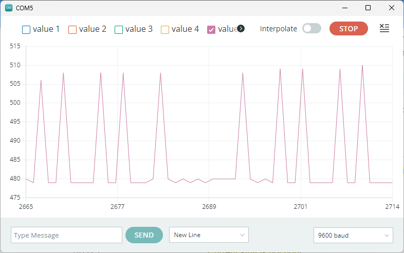
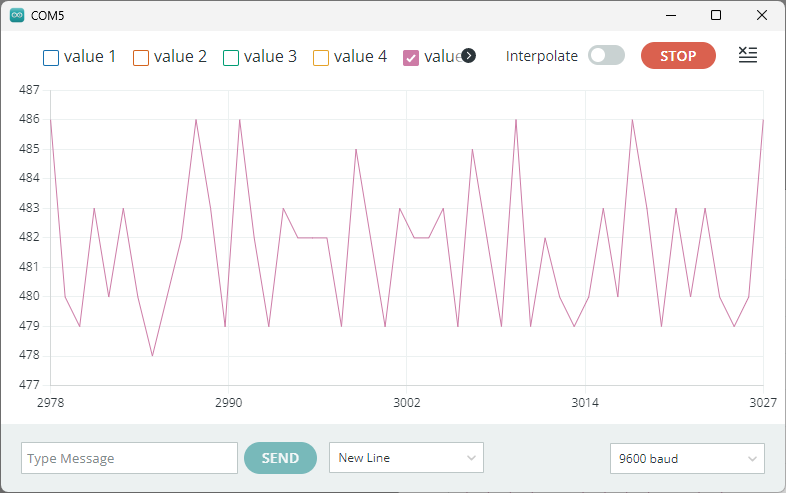

# Measure the Output of the Sharp IR Distance Sensor
!!! info "GTA Marking"
    This is an assessed Exercise. When you have completed the [Assessed Exercise](#irSensorExercise), you should show your work to a GTA to get marked.
    

!!! Note
    Before starting these exercises, you should ensure that you have completed the circuit on the robot chassis, as suggested on <debugHL>[Building the Robot: Fig. 11](../RobotBuild.md/#irSensorPic)</debugHL>. Furthermore, you should ensure that all the connections described in the [Building the Robot: Circuit Layout for the IR Sensor Exercise](../RobotBuild.md#irSensor) are correct.

The following video is a quick demonstration of the final outcome from this exercise:

<figure>
<div style="text-align: center;">
<iframe id="kaltura_player" src='https://cdnapisec.kaltura.com/p/2103181/embedPlaykitJs/uiconf_id/53345422?iframeembed=true&amp;entry_id=1_sf98riu0&amp;config%5Bprovider%5D=%7B%22widgetId%22%3A%221_zed54ef2%22%7D&amp;config%5Bplayback%5D=%7B%22startTime%22%3A0%7D'  style="width: 400px;height: 285px;border: 0;" allowfullscreen webkitallowfullscreen mozAllowFullScreen allow="autoplay *; fullscreen *; encrypted-media *" sandbox="allow-downloads allow-forms allow-same-origin allow-scripts allow-top-navigation allow-pointer-lock allow-popups allow-modals allow-orientation-lock allow-popups-to-escape-sandbox allow-presentation allow-top-navigation-by-user-activation" title="IR Sensor Video"></iframe>
</div>
<figcaption>Video demonstrating the expected outcome from this exercise</figcaption>
</figure>

## Introduction and Background

The aim of this exercise is to generate a graph of sensor measurement from the Sharp IR distance sensor against measurement distance. During this exercise, you will interface the Sharp IR distance sensor with the Arduino, record the measured voltage as a function of the distance to a target, and observe any constraints for the operation of this sensor.

Before you start this exercise, you will need to construct the circuit according to <debugHL>[the IR sensor circuit instructions](../RobotBuild.md#irSensor)</debugHL> in the <debugHL>[Building the Robot Document](../RobotBuild.md)</debugHL>.

### Noise on the IR sensor
The IR sensor is not an ideal sensor and induces noise onto the output of the sensor, as shown in <debugHL>[Fig 1](#irWithNoise)</debugHL>.

<figure  markdown="span">
  <a name="irWithNoise"></a>
  
  <figcaption>Serial Plotter Showing Noise on the IR distance sensor.</figcaption>
  </figure>

  A <debugHL>[simple moving averaging](https://en.wikipedia.org/wiki/Moving_average)</debugHL> filter technique can be used on the data to reduce the noise content of the signal. A simple, but effective, implementation of this technique is shown in the Averaging Code, below:

``` Arduino title="Averaging Code"
//Read the IR sensor
irVal = analogRead(irPin);

// accumulate a further 7 readings
irVal = irVal + analogRead(irPin);
irVal = irVal + analogRead(irPin);
irVal = irVal + analogRead(irPin);
irVal = irVal + analogRead(irPin);
irVal = irVal + analogRead(irPin);
irVal = irVal + analogRead(irPin);
irVal = irVal + analogRead(irPin);

// right shift 3 places to divide by 8
irVal = irVal >> 3;
    
```
The Averaging Code, above, sums the result of 8 ADC readings of the IR sensor and take the average value of these readings. This is a crude, but effective method for noise reduction, in this instance. The results of this implementation can be seen from the data shown in <debugHL>[Fig 2](#averagedIrSensor)</debugHL>.

<figure  markdown="span">
  <a name="averagedIrSensor"></a>
  
  <figcaption>Serial Plotter Showing the Averaged IR Sensor Data.</figcaption>
  </figure>

Camparing the magnitude of the noise on the IR sensor measurement, between <debugHL>[Fig 1](#irWithNoise)</debugHL> and <debugHL>[Fig 2](#averagedIrSensor)</debugHL> it can be seen that this averaging technique has significantly reduced the sensor noise. 

### Experimental Setup with Lolly Stick up
The IR sensor is sensitive to picking up reflections from any surface that it is operating. It has been found from experimentation, that raising the sensor above the surface that it is operating produces improved and more consistant results.

As a result, when using the IR sensor, you should ensure that the lolly stick assembly is in the upright position, as shown in the righthand figure in the <debugHL>[Building the Robot document](../RobotBuild.md#LollyUp)</debugHL>

For more details on concerning the pin connections for the Sharp GP2Y0A21YK0F distance measurement sensor, see the data sheet for the sensor on the Blackboard site:

  * <debugHL>ACS231 Blackboards Site>>Mechatronics Kit Information>> Component Data Sheets and Technical Documentation.</debugHL>

## Expected Results
The IR sensor has a non-linear distance to output voltage characteristic, as illustrated in <debugHL>[Fig 3](#irSensorDist)</debugHL>. This graph has been provided as an example characteristic for how your data should come out...except that your results should have a y-axis scale!

<figure  markdown="span">
  <a name="irSensorDist"></a>
  
  <figcaption>Characteristic measurement result from the IR distance sensor.</figcaption>
</figure>

<a name = "irSensorExercise"></a>
## Assessed Exercise
For this exercise you will write an Arduino sketch to measure the output of the IR sensor and display its value of on the serial monitor. The distance measurements should be taken at static positions, using a series of measurement points similar to:

1cm, 2cm, 3cm, 4cm, 5cm, 6cm, 7cm, 8cm, 9cm, 10cm, 15cm, 20cm, 25cm, 30cm, 35cm, 40cm, 45cm, 50cm, 55cm, 60cm, 65cm, 70cm, 75cm, and 80cm

You should plot your results in a computer package, such as Excel or MATLAB, with the x-axis as the distance measured, and the y-axis as the ADC measurement value. 

**Procedure:**

<ol>
  <li> The starting point for this exercise is the <debugHL><a href = ../../RobotBuild#irSensor>circuit layout for the IR sensor</a></debugHL> and the potentiometer code, <debugHL><a href =../Ex1ledPattern#potInoCode>POT.ini</a></debugHL> located at the end of the <debugHL><a href =../Ex1ledPattern>LED pattern exercise</a></debugHL>.</li>

  <li> Write an Arduino sketch to read the analogue measurement value from the IR distance sensor and display the reading on the serial monitor. (It is acceptable to use a fresh copy of the <debugHL><a href = ../Ex1ledPattern/#potInoCode>POT.ini</a></debugHL> as a template for this exercise.)</li>
</ol>

Once you have the measured value of the distance sensor being streamed to the serial monitor, you will be required to plot the distance sensor measurement value against distance measured, (with a ruler/scale).

<ol start=3>
  <li> Perform an experiment to characterise the Sharp IR sensor between 1cm and 80cm distance. The results from this experiment should be a graph of the ADC measurement value from the Sharp IR distance sensor, against the distance from the target. Note: Your graph should have a similar characteristic to that shown in <debugHL><a href = ./#irSensorDist>Fig 3</a></debugHL>.</li>
</ol>

## What we expect to see from your demonstration?

When completed, your code should allow you to run an experiment to draw the following graph:

* A graph of ADC measurement value against distance.
* The trace should be correctly framed within the axes.
* Appropriate axes labels, with units and a descriptive graph title.
You should plot your results in a computer package, such as Excel or MATLAB, with the x-axis as the distance measured, and the y-axis as the ADC measurement value, as illustrated in <debugHL>[Fig 3](#irSensorDist)</debugHL>

We expect you to also demonstrate the operation of your code and the output on the Serial Monitor, as describes in the procedure.


!!! Success "Now Get Your Work Marked by a GTA"
    Once you have completed your code and are satisfied with its operation, you should show your work to a GTA for marking.
