# Building the Robot Chassis

## Introduction

The system described in this section is the configuration that the author used during the development of the Introduction to Arduino exercises on this module, as shown in <debugHL>[Fig 1](#chassisPic)</debugHL>. This configuration is the recommended configuration for the exercises during this section of the course.

<figure  markdown="span">
  
  
  <figcaption>Picture of the completed robot.</figcaption>
  </figure>

## Adding the mechanical components to the chassis
This section will discuss the assembly of the mechanical system, and [a later section](#ElecConn "Electronic Component Layout and Connections") will discuss the assembly of the electronic circuitry.

<figure  markdown="span">
  
  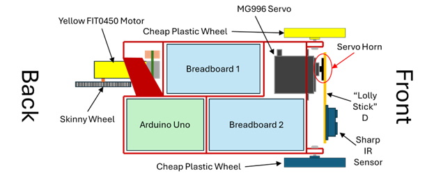
  <figcaption>Annotated layout of the robot chassis.</figcaption>
  </figure>

Due to the design of the robot chassis, some elements of the robot must be constructed in order, due to overlapping parts, see <debugHL>[Fig 2](#chassislayout)</debugHL> for a diagram of the layout. The suggested order of construction is:

1.	Attach the yellow FIT0450 motor to the back of the chassis
1.	Attach the skinny wheel to the motor
1.	Attach the cheap plastic wheels to the front of the chassis
1.	Attach the MG996 servo to the front of the chassis
1.	Attach the IR sensor to Lolly Stick D
1.	Attach the lolly stick to the servo horn
1.	Attach the assembled lolly stick with IR sensor and servo horn to the servo shaft.

### Attaching the FIT0450 and Skinny wheel

This is the most awkward component to attach to the chassis. 

* Push 2x M3x30 through the motor, from the brass shaft side.
* Carefully insert the motor into the chassis and manipulate it so that the screws are aligned with the screw holes in the chassis side wall.
* With a screwdriver inserted through the access holes in the chassis, push the screws through the holes and use 2x M3 nuts to fasten the motor to the chassis.
* Push the skinny wheel onto the motor shaft and use an M3x6 machine screw to fasten the wheel to the motor shaft.

### Attaching the Cheap Plastic wheels

!!! Note "Do this Before Attaching The Servo"
    These wheels must be attached before the servo, because the servo obscures access to the screw heads for the left wheel.

The cheap plastic wheels should be attached to the lugs at the front of the chassis M4x20 machine screws. Because these wheels rotate freely, you will either need a pair of <debugHL><a href = "https://www.boltscience.com/pages/twonuts.htm" target="_blank">locking nuts</a></debugHL>, (the method I have used in <debugHL>[Fig 1](#chassisPic)</debugHL>), or using an M4 nylon-insert lock nut – nyloc, to ensure the wheels are secure but free to rotate, as illustrated in <debugHL>[Fig 3](#nylocWheel)</debugHL>.

<figure  markdown="span">
  
  
  <figcaption>Fixing the cheap plastic wheels using nyloc nuts.</figcaption>
  </figure>

### Attaching the MG996 Servo

!!! Note "Do this After You Have Attached Both of the Wheels"

The MG996 servo is attached to the robot chassis using 3x M4x12 screws and 1x M4x6 screw, as illustrated in Figure 3. The shorter M4x6 screw is required to ensure that breadboard 2, see <debugHL>[Fig 4](#servoNuts)</debugHL>, will fit into the chassis. If you use an M4x12 screw in this location, the tail of the screw is too long and breadboard 2 will not fit into the space provided in the chassis. Figure 3 illustrates which of the 4 M4 screws should be the M4x6.

<figure  markdown="span">
  
  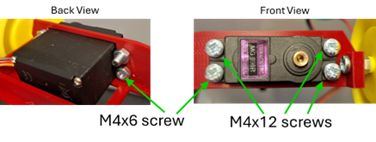
  <figcaption>Fixing screws for the MG996 Servo.</figcaption>
  </figure>

###	Assembling the Lolly Stick D Assembly
The lolly stick assembly comprises of the Sharp IR sensor, a laser cut plywood linkage and a servo horn for the MG996, as shown in <debugHL>[Fig 4](#LollyAss)</debugHL>.

<figure  markdown="span">
  
  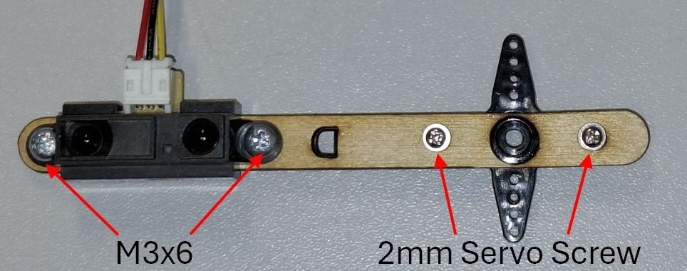
  <figcaption>Fixing Screws for the Lolly Stick Assembly.</figcaption>
  </figure>

It is recommended that you assemble the lolly stick assembly as shown in <debugHL>[Fig 5](#LollyAss)</debugHL>, because this results in the header terminals for the IR sensor being on the top side of the IR sensor, when the lolly stick is in the horizontal position, see <debugHL>[Fig 6](#LollyUp)</debugHL>.

The IR sensor is fixed to the lolly stick with 2x M3x6 screws and 2x M3 nuts, as can be seen in <debugHL>[Fig 5](#LollyAss)</debugHL>.

The servo horn is attached to the lolly stick using 2x M2x8mm Phillips Head Flange Screws. 

!!! Warning "Warning: Sharp Screws"
    The sharp ends of the Flange screws will protrude through the opposite side of the servo horn. Please be careful while handling this assembly to prevent causing minor injury on the protruding screws.

###	Attaching the Lolly Stick D Assembly to the Servo
The servo horn pushes onto the servo MG996 servo shaft, then a M3x6 screw is used to fix it into position. Once attached, ensure the servo can rotate between horizontal and vertical, see <debugHL>[Fig 6](#LollyUp)</debugHL>.

!!! info
    This assembly will require repositioning at the start of the control of the standard servo exercise to ensure that the position is set correctly for the exercise.

<figure  markdown="span">
  
  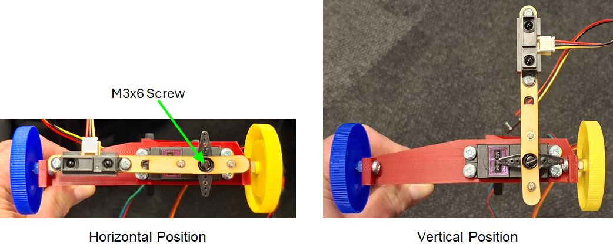
  <figcaption>Pictures of the lolly stick assembly attached to the servo, rotated into the horizontal and vertical positions.</figcaption>
  </figure>

##	Electronic Component Layout and Connections

The layout of the electronic components on the breadboard is entirely up to you, but following sections illustrate how they were laid out during the design and prototyping stages of these exercises. The author recommends following this layout because it also follows the example code provided for the exercises, and it is a tried and tested layout.

The connections for each exercise are discussed in more detail in the <debugHL>[following sections](#ExCirLay)</debugHL>, but these subsections provide a bit of high level detail concerning the component placement and the <debugHL>[DC power socket](#dcPowerSocket)</debugHL>.

### Breadboard layouts

We suggest that the components should be placed on the two breadboards, as shown in <debugHL>[Fig 7](#BreadboardComps)</debugHL>, with each breadboard containing:
  
* Breadboard 1: the LEDs, button and the motor driver board. 
* Breadboard 2: the DC power inlet socket, 10K potentiometer and a 12-way header strip, used to connect the motor power and encoder, MG996 servo and the Sharp IR sensor. 

The location of breadboard 1 and breadboard 2 in the robot chassis is illustrated in <debugHL>[Fig 2](#chassislayout)</debugHL> and shown in the <debugHL>[Fig 1](#chassisPic)</debugHL>.

<figure  markdown="span">
  
  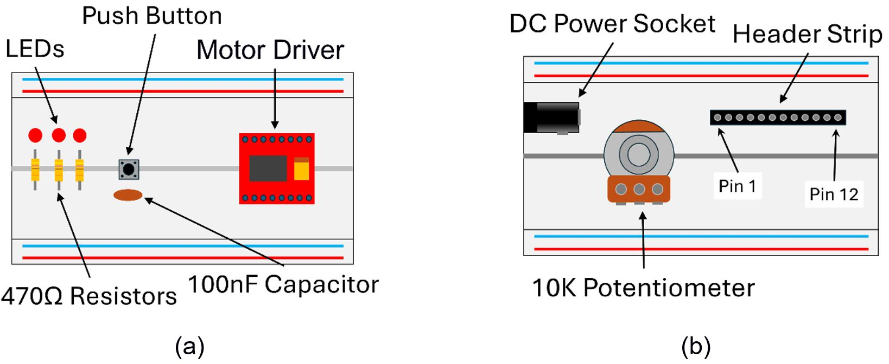
  <figcaption>Component positioning for (a) breadboard 1 and (b) breadboard 2.</figcaption>
  </figure>

###	External DC Power Socket and Connection
Some of the robot systems draw too much power to be supplied directly from the Arduino, via the USB link. If you were to were to power the MG996 Servo or the DC motor from the Arduino, then you may pull too much power from the +5V rail and experience erratic behaviour due to the Arduino intermittently restarting – this is referred to as a <debugHL><a href = "https://www.allaboutcircuits.com/technical-articles/what-is-brown-out-reset-microcontroller-prevent-false-power-down/" target="_blank">brownout restart</a></debugHL>.
To overcome this problem, we will use an additional external DC power supply to provide extra current capability for some of the components – MG966 servos and DC motor driver board. To facilitate this, you will add a DC power connector to your robot system, shown in <debugHL>[Fig 8](#DcPower)</debugHL>.
 
<figure  markdown="span">
  
  
  <figcaption>Annotated picture of the external power supply connector pins.</figcaption>
  </figure>
In previous years, we have had problems with the DC power connector slipping out of the breadboard. To significantly reduce the chances of this, a cable tie can be used strap the dc connector down to breadboard 2, as illustrated in <debugHL>[Fig 9](#CableTie)</debugHL>.

<figure  markdown="span">
  
  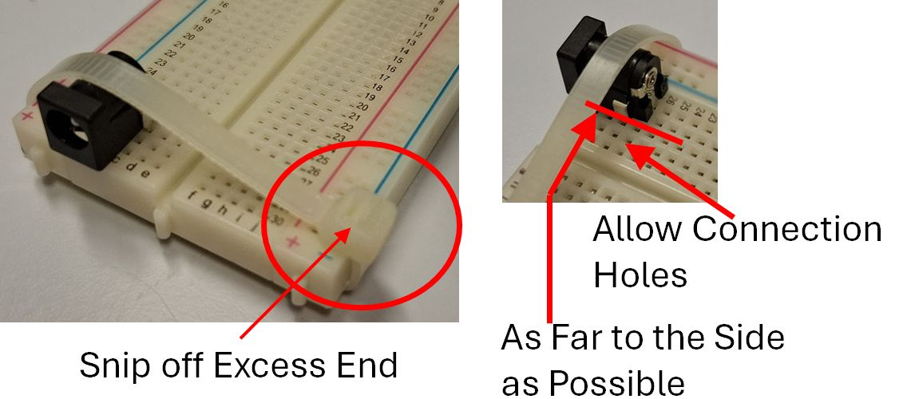
  <figcaption>Photograph of the cable tie used to hold the DC power connector and the  positioning of the DC power connector on the breadboard.</figcaption>
  </figure>

!!! Note
    Ensure that the cable tie is tight around the board and the connector will not move, before snipping the loose end.

The following section provides important details concerning the two different power supplies on the breadboards, and MUST be read before continuing.

### Arduino and External Power Supplies Lines

There are two +5V power supplies on the robot chassis:

1. The +5V supply from the Arduino
2. The external +5V from the AC-DC Plug-in Power Supply.

UNDER NO CIRCUMSTANCE should the +5V lines of these power supplied be connected together. You must, however, connect all the GND lines of these power supplies, and other systems, to a common GND net/node on your robot chassis to ensure that all the working from the same reference voltage.

The external +5V should only be connected to the Vm connection of the motor drive board and the V+ power connections of any servo used on your system. The Arduino +5V should be used for the Vcc connection of the motor drive board and any other connection requiring +5V, which is not connected to the external +5V.

!!! Danger "Danger: You can destroy your Laptop motherboard if you get this wrong"
    If you connect the +5V supply of the Arduino and the external power supply together you risk destroying the motherboard of your laptop by sending a voltage spike up the USB lead when the servo or the DC motor operate.

    Read the [Disclaimer](./Disclaimer.md) document before proceeding.

    The University and MEE take no responsibility for damaged laptops due to this issue. We recommend using the University IT equipment to mitigate damaging your personal equipment.

*At this point you may have noticed that we don't want you to connect the external +5V to the Arduino +5V. This is because we don't want to tell any other student that we will not be paying for repairs to their personal IT equipment... It is not a fun conversation to have!*

## Suggested Circuit Layouts for the Exercises

The electronic system for the robot can be incrementally built as required for the exercise you are working on. The exercises are designed, such that, you only need to add components to the system, with the later exercises build on the previous. This means that no circuitry needs to be removed between exercises.

Before you start any of the following exercises, you will need to add extra elements into your robot circuit.

1. [Basic: LED Pattern](#LEDPatternBuild)
    * No extra circuitry is required for the Calibration of Potentiometer Angle Exercise. This uses the potentiometer from the LED Pattern Exercise.
2. [Basic: IR Sensor Measurement + Graph](#irSensor)
3. [Basic: Externally Powered Servo](#poweredServo)
4. [Basic: DC Motor](#dcMotor)
5. [Basic: Encoders and Motor](#Encoder)

!!! Note "Note: Advanced Exercises" 
    The advanced exercises do not require any extra circuit build. They work from the circuit that has been constructed for the final [Basic Exercise: Encoders and Motor](#Encoder).

#### Circuit Layout for the LED Pattern and Calibration of Potentiometer Angle Exercises

The following circuit layout is sufficient to complete both the [LED pattern](./BasicExercises/ledPattern.md) Exercise. This section illustrates where to layout and the connections for: the three LEDs and associated resistors, the button and the potentiometer, as illustrated in <debugHL>[Fig. 10](#LEDPattern)</debugHL>.

<figure  markdown="span">
  
  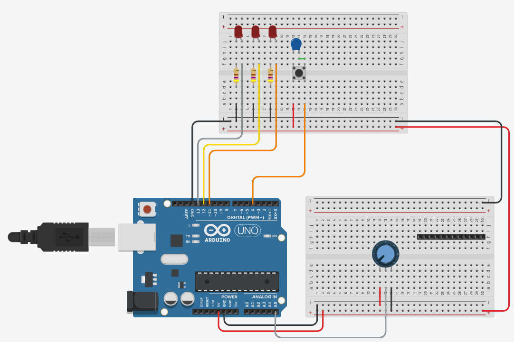
  <figcaption>Diagram showing the suggested component layout and wiring for the LED Pattern Exercise.</figcaption>
  </figure>

The extra components list required for this exercise, shown in <debugHL>[Fig. 10](#LEDPattern)</debugHL>, other than the Arduino and 2x breadboards:

* 3x LED
* 3x 470Ω resistor
* Tactile button
* 100nF capacitor
* Potentiometer
* 12-way header

<debugHL>[Fig. 10](#LEDPattern)</debugHL> illustrates the component layout, but for clarity, <debugHL>[Table 1](#ledPatConnect)</debugHL> lists the connections into the Arduino that we recommend for this section:

<table >
  
  <thead>
    <tr> <th>Arduino Pin:</th> <th>Description:</th> </tr>
  </thead>
  <tbody>
    <tr><td>DIO 4</td><td>Button</td> </tr>    
    <tr><td>DIO 11</td><td>LED 1</td> </tr>    
    <tr><td>DIO 12</td><td>LED 2</td> </tr>    
    <tr><td>DIO 13</td><td>LED 3</td> </tr>    
    <tr><td>A5</td><td>Potentiometer Input</td> </tr>    
  </tbody>
<caption>Suggested Connection table for the LED Pattern Exercise.</caption>
</table>

#### Circuit Layout for the IR Sensor Exercise

This section illustrates the connection of the Sharp IR sensor into the circuit, required for the [IR Sensor Measurement and Graph](./BasicExercises/IrSensor.md) exercise, as illustrated in <debugHL>[Fig. 11](#irSensorPic)</debugHL>. You should keep the circuit wired from the previous section.
 

<figure  markdown="span">
  
  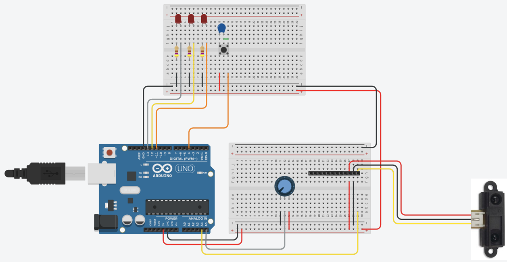
  <figcaption>Diagram showing the suggested component layout and wiring for the IR Sensor Exercise.</figcaption>
  </figure>

 Extra parts required for this configuration:

 * Sharp IR Sensor
 * Sharp IR Sensor cable

 <debugHL>[Table 2](#IRConnect)</debugHL> lists the connections into the Arduino that we recommend for the IR Sensor:

 <table >
  
  <thead>
    <tr> <th>Arduino Pin:</th> <th>Description:</th> </tr>
  </thead>
  <tbody>
    <tr><td>A4</td><td>IR Sensor Output</td> </tr>    
  </tbody>
  <caption>Suggested Connection Table for the LED Pattern Exercise.</caption>
</table>

The Sharp IR sensor cable has header connections attached to the non-sensor end. The header connections should plug into the <debugHL>[12-way header](#12WayHeader)</debugHL> on the breadboard, in the place illustrated in <debugHL>[Fig. 11](#irSensorPic)</debugHL>.

#### Circuit Layout for the Externally Powered Servo Exercise

The servo will be used in the <debugHL>[Driving a Servo Motor](./BasicExercises/DriveServoMotor.md)</debugHL> Exercise. <debugHL>[Fig. 12](#poweredServo)</debugHL> illustrates the connections required for the servo and the external DC power socket. You should keep the circuit wired from the previous section.

!!! Danger "Warning"
    UNDER NO CIRCUMSTANCE should the +5V External power supply be connected to the +5V Arduino supply. You must, however, connect all the GND lines of these power supplies, and other systems, to a common GND net/node on your robot chassis to ensure that all the working from the same reference voltage.

<figure  markdown="span">
  
  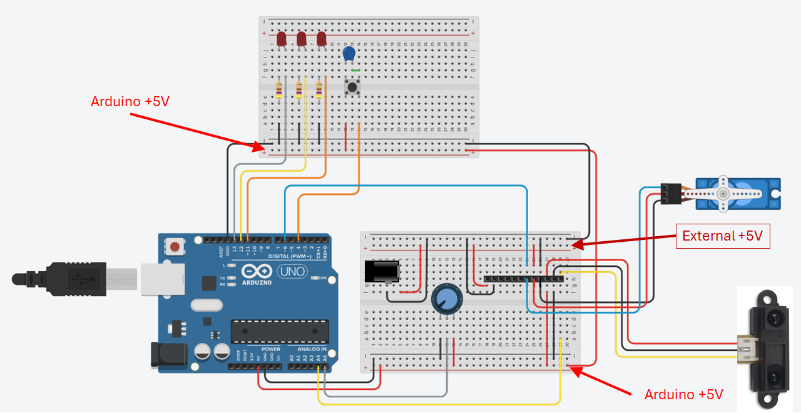
  <figcaption>Diagram showing the suggested component layout and wiring for the Externally Powered Servo Exercise.</figcaption>
  </figure>

The extra components list required for this exercise, shown in <debugHL>[Fig. 12](#poweredServo)</debugHL>, other than the Arduino and 2x breadboards:

* DC Servo
* DC power socket (SG90 for the <debugHL>[initial servo exercise](./BasicExercises/DriveServoMotor.md#mg90Servo)</debugHL> and final assessed Exercise)

!!!Note

    The <debugHL>[initial servo exercise](./BasicExercises/DriveServoMotor.md#mg90Servo)</debugHL> used the MG90 powered from the Arduino +5V supply, not the external 5V supply. You may wish to consider this when building your circuit.

<debugHL>[Table 3](#ServoMotorConnect)</debugHL> lists the connections into the Arduino that we recommend for the servo exercise:

<table>
  
  <thead>
    <tr> <th>Arduino Pin:</th> <th>Description:</th> </tr>
  </thead>
  <tbody>
    <tr><td>DIO 6</td><td>Servomotor Signal Pin</td> </tr>    
  </tbody>
  <caption>Suggested Connection Table for the Servomotor.</caption>
</table>

#### Circuit Layout for the DC Motor Exercise

The DC motor exercise requires both the TB6612FG and the DC motor to be wired into the circuit, as illustrated in <debugHL>[Fig. 13](#dcMotorPic)</debugHL>. During this section you will only be wiring the power connections to the motor, and not the encoder signals. You should keep the circuit wired from the previous section.

<figure  markdown="span">
  
  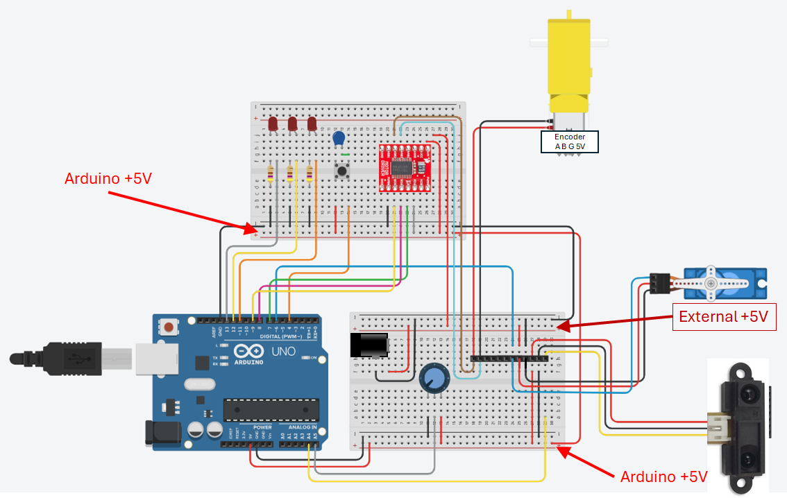
  <figcaption>Diagram showing the suggested component layout and wiring for the DC Motor Exercise.</figcaption>
  </figure>

Extra parts required for this configuration:
  
* TB6612FG driver board
* DC motor
* DC motor power cable

Due to the most convenient orientation of the TB6612FG motor driver board on the robot, we will be using channel B for these exercises. The TB6612FG driver board is shown in <debugHL>[Fig 14](#TB6612FG)</debugHL>.

<figure  markdown="span">
  
  
  <figcaption>Picture of the TB6612FG motor driver board, with pins labelled.</figcaption>
  </figure>

<debugHL>[Table 4](#DcMotorConnect)</debugHL> lists the connections into the Arduino that we recommend for the DC motor exercise:

<table>
  
  <thead>
    <tr> <th>Arduino Pin:</th> <th>Description:</th> </tr>
  </thead>
  <tbody>
    <tr><td>DIO 5</td><td>PWM Signal Pin</td> </tr>    
    <tr><td>DIO 8</td><td>BI1 Signal Pin</td> </tr>    
    <tr><td>DIO 7</td><td>BI2 Signal Pin</td> </tr>    
  </tbody>
  <caption>Suggested Connection Table for the DC Motor.</caption>
</table>

!!! Note
    All the GND connections are internally connected on the TB6612FG breakout board, therefore, only one GND connection is needed to the power system.

<table>
  
  <thead>
    <tr> <th>Pin:</th><th>Description:</th><th>Connected to:</th> </tr>
  </thead>
  <tbody>
    <tr> <td>Vm</td><td>Motor Power System Supply</td><td><strong>External +5V</strong></td> </tr>    
    <tr> <td>Vcc</td><td>Logic Control Power Supply</td><td><strong>Arduino +5V</strong></td> </tr>    
    <tr> <td>GND</td><td>Ground</td><td>N/C</td> </tr>    
    <tr> <td>AO1</td><td>Channel A Motor Output 1</td><td>N/C</td> </tr>    
    <tr> <td>AO2</td><td>Channel A Motor Output 2</td><td>N/C</td> </tr>    
    <tr> <td>BO2</td><td>Channel B Motor Output 2</td><td>Motor -</td> </tr>    
    <tr> <td>BO1</td><td>Channel B Motor Output 1</td><td>Motor +</td> </tr>    
    <tr> <td>GND</td><td>Ground</td><td></td> </tr>    
    <tr> <td>PWMA</td><td>Channel A PWM Signal</td><td>N/C</td> </tr>    
    <tr> <td>AI2</td><td>Channel A Bridge Configuration Input 2</td><td>N/C</td> </tr>    
    <tr> <td>AI1</td><td>Channel A Bridge Configuration Input 1</td><td>N/C</td> </tr>    
    <tr> <td>Standby</td><td>Driver Chip Standby Signal</td><td>Arduino +5V</td> </tr>    
    <tr> <td>BI1</td><td>Channel B Bridge Configuration Input 1</td><td>Arduino DIO 8</td> </tr>    
    <tr> <td>BI2</td><td>Channel B Bridge Configuration Input 2</td><td>Arduino DIO 7</td> </tr>    
    <tr> <td>PWMB</td><td>Channel B PWM Signal</td><td>Arduino DIO 5</td> </tr>    
    <tr> <td>GND</td><td>Ground</td><td>Power Supply GND</td> </tr>  
  </tbody>
<caption>Pin connections to the TB6612FG motor driver board.</caption>
</table>

The DC motor power is connected through the <debugHL>[12-way header](#12WayHeader)</debugHL>, as shown in <debugHL>[Fig. 13](#EncoderPic)</debugHL>. The connections for the driver board are shown in <debugHL>[Table 5](#TB6612FGConnect)</debugHL>. 

#### Circuit Layout for the Encoders and Motor Exercise

The final part of the circuit to connect is the motor encoder to the Arduino, as illustrated in <debugHL>[Fig. 15](#EncoderPic)</debugHL>. The encoder is connected through the <debugHL>[12-way header](#12WayHeader)</debugHL>, as shown in <debugHL>[Fig. 15](#EncoderPic)</debugHL>.

<figure  markdown="span">
  
  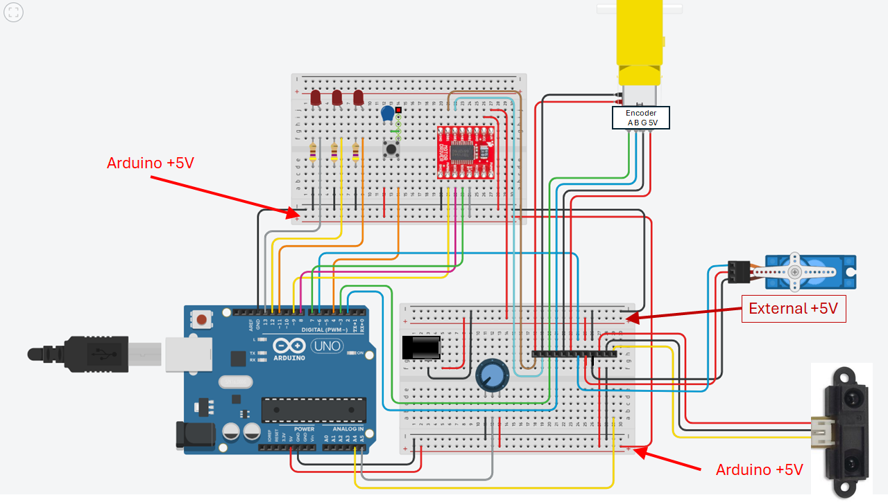
  <figcaption>Diagram showing the suggested component layout and wiring for the Encoders and Motor Exercise.</figcaption>
  </figure>

Extra parts required for this configuration:
  
* DC motor encoder cable

<debugHL>[Table 4](#EncoderConnect)</debugHL> lists the connections into the Arduino that we recommend for the DC motor exercise:

<table>
  
  <thead>
    <tr> <th>Arduino Pin:</th> <th>Description:</th> </tr>
  </thead>
  <tbody>
    <tr><td>DIO 2</td><td>Encoder B Signal</td> </tr>    
    <tr><td>DIO 3</td><td>Encoder A Signal</td> </tr>       
  </tbody>
  <caption>Suggested Connection Table for the Rotary Encoder.</caption>
</table>

###	The 12-Way Header Connections

The 12-way header connector provides a convenient method for interfacing some of the system components: motor, encoder, servo and, IR sensor, to the breadboard for easy connection to the remaining electrical system. A summary of the connections used in development are provided in <debugHL>[Table 7](#headerConnect)</debugHL>.

<table>
  
  <thead>
    <tr> <th>Pin:</th><th>Description:</th><th>Connected to:</th> </tr>
  </thead>
  <tbody>
    <tr> <td>1</td><td>Motor +</td><td>Driver Board BO1</td> </tr>    
    <tr> <td>2</td><td>Motor -</td><td>Driver Board BO2</td> </tr>    
    <tr> <td>3</td><td>Encoder A Signal</td><td>Arduino DIO 3</td> </tr>    
    <tr> <td>4</td><td>Encoder B Signal</td><td>Arduino DIO 2</td> </tr>  
    <tr> <td>5</td><td>Encoder GND</td><td>GND</td> </tr>    
    <tr> <td>6</td><td>Encoder +5V</td><td>Arduino +5V</td> </tr>    
    <tr> <td>7</td><td>Servo Signal</td><td>Arduino DIO 6</td> </tr>    
    <tr> <td>8</td><td>Servo +5V</td><td>External +5V</td> </tr> 
    <tr> <td>9</td><td>Servo GND</td><td>GND</td> </tr>    
    <tr> <td>10</td><td>IR Sensor +5V</td><td>Arduino +5V</td> </tr>    
    <tr> <td>11</td><td>IR Sensor GND</td><td>GND</td> </tr>    
    <tr> <td >12</td><td>IR Sensor Signal</td><td>Arduino Analogue Input A4</td> </tr>    
  </tbody>
<caption>12-Way Header Connections to robot components.</caption>
</table>

